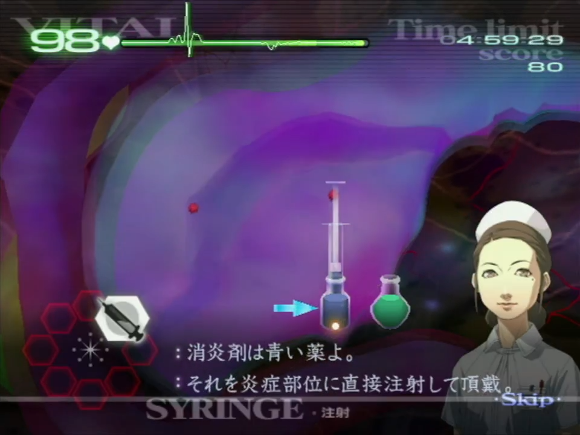

# Chapter 1

[Back to Main Page](../index.md)
	
## 1-1*

Be mindful of the small little delays whenever Mary talks. This is notably right att he start when she asks you to suture, and again when she instructs you to use the forceps.  
You should suture the left cut, and then the right for less cursor movement.  
  
After you've pulled out the shards, tap the gel on each of the small cuts.  
For the incision, you will need to ensure all of it is covered with hel berfore you can select the scalpel.  
Because the three cuts from the shards in the arm are quite close, you can slather gel over these.  
Don't forget to gel before the bandage.
  
## 1-2*

When you go to inject the stabiliser, make sure to take a full draw. Mary will know if you skimp out!  
Just like 1-1, there is a small delay for each step as Mary talks.  
The Tumour is always located in the same spot (as below). Be sure to ultrasound exactly where it is, so you don't get additional dialogue from Mary.  
  
Cutting the tumour can be done in any straight line across the location, it doesn't necessarily have to be vertically. In this instance, doing a small vertical slash is the fastest way to expose it.  
After the membrane, just tap the gel directly in the centre of the membrane. You should do this for all membranes going forward.  
Don't forget you can just bandage without putting any gel down.
	
## 1-3*

The inflammations only need about 1/4 of the syringe, just where the plunger meets the edge of the vial (seen below).  
  
The tumours are always in the same spots (seen below) and you don't need to ultrasound them first.  
When you are exposing these tumours, you can either cut each one individually, or do a sort of V-Shape to get them in one sweeping motion.  
  
After draining each tumour, cut in the opposite order you drained them in (aka, drain 1>2>3 then cut 3>2>1). If you are not quite fast enough to do this, cut them in the same order you drained them.  
Again, for the gel, tapping on the centre of each membrane is best.

## 1-5

This is one of the first operations you might want to consider opening the patient without gel. However, this is considered pretty tricky and only saves you around 0.4s. Give it a try in practice, but don't feel obligated to do this strat.  
When lasering the polyps, aim to laser in between each cluster (seen below).  
The fourth polyp will always cause a blood pool, Angie will point this out, so be ready for dialogue and required tool switch.  
  
After lasering and gelling over all the holes, pre-emptively move the view to where the next cluster will spawn. This will always alternate from upper to lower area, with a total of 5 areas which ends at the top of the throat.
	
## 1-6

For this operation you'll need to be careful of the vitas. Below are suggestions based on my own experience, but I highly recommend seeing what works for you in terms of consistency.  
You first want to deal with the tumours. They are always in the same location, and should not use the ultrasound to reveal them first. You can do two diagonal slashes to reveal them in two pairs.  
  
Just like in 1-3, you'll want to drain these, and then cut them out in reverse order (1>2>3>4 followed by 4>3>2>1). This requires you to be precise and quick, and if you are unsure, aim to tackle two at a time.  
If the vitals are ticking down too quickly, it suggests you need to work on your precision with the scalpel.  
The faster you deal with these tumours, the safer you'll be on the inflammation stage, and therefore no vital boosts.  
Once you have tapped the gel on the membranes, begin dealing with the inflammations. You should take a full draw of the syringe and inject it all before going back for more, even if you don't fully treat the inflammation. Some inflammation hitboxes overlap, and you can use this to treat multiple at once.  
  
These inflammations circled have clear overlapping hitboxes, and recommended groupings. However, this can be applies to others too and isn't exclusively where they overlap.  
***We complete the operation in this way, as the membranes take time to disppear. This way there is no time wasted waiting for the membranes to fade.***  
Once Angie requests for you to ultrasound, you will need to use it 10 times to progress, ideally selecting this before Angie prompts you to.
	
## 1-8

The operation starts with a defib, so pull back your Wiimote premptively so you can push forward once it hits. When you hit B, you can pull back your Wiimote back to your resting position.  
Once inside the patient, aim to pull the glass out all in one go. The vitals don't drop quick enough for you need to use the gel immediately. Below is a suggested path, but use whatever works for you.  
  
After pulling out the shards, tap the gel on each cut as it is faster than slathering it all over.  
Once this is done, you have a brief moment before another defib hits, so pull back on your Wiimote. Don't worry if the vitals are trickling down, as they will get lowered to 10 for the defib and recovered after.  
There will be an extra shard of glass after the defib, followed by the Auto-HT and cut to suture. This is a bit larger than most, so you may need extra lines to complete the suture.
