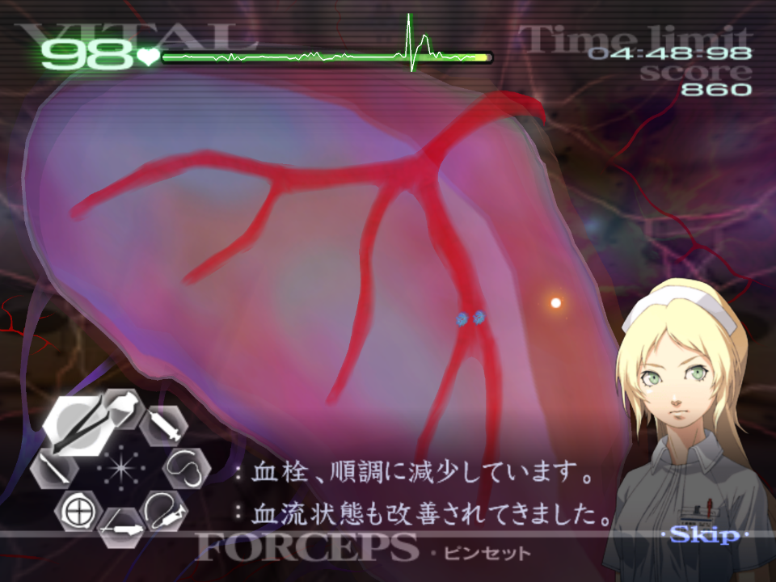
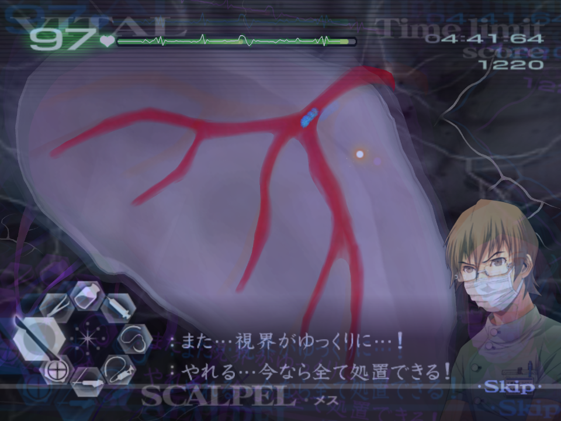
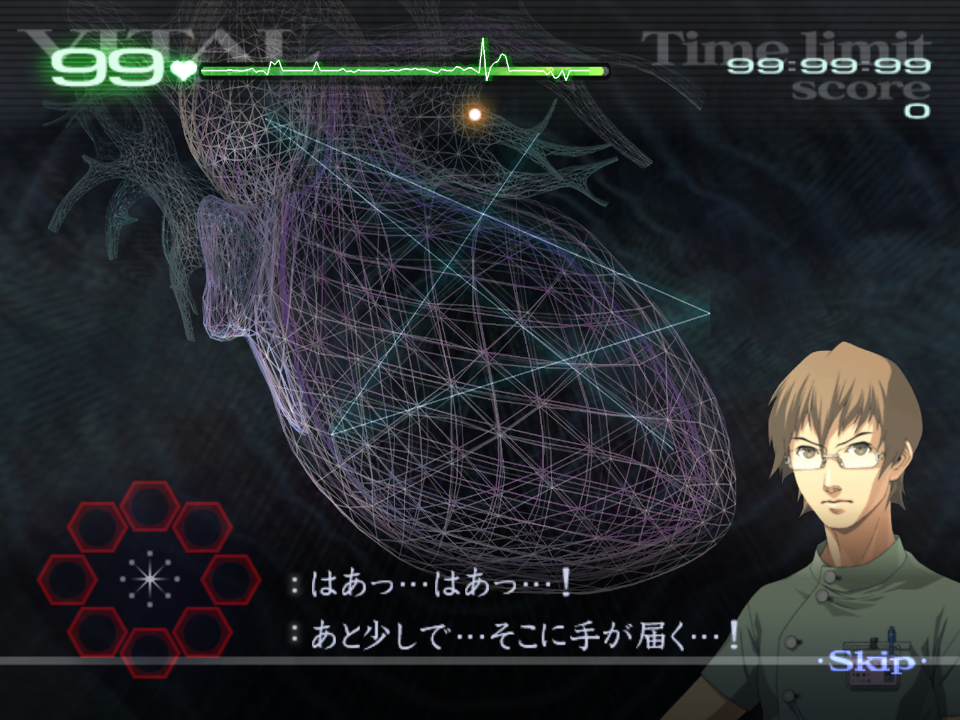
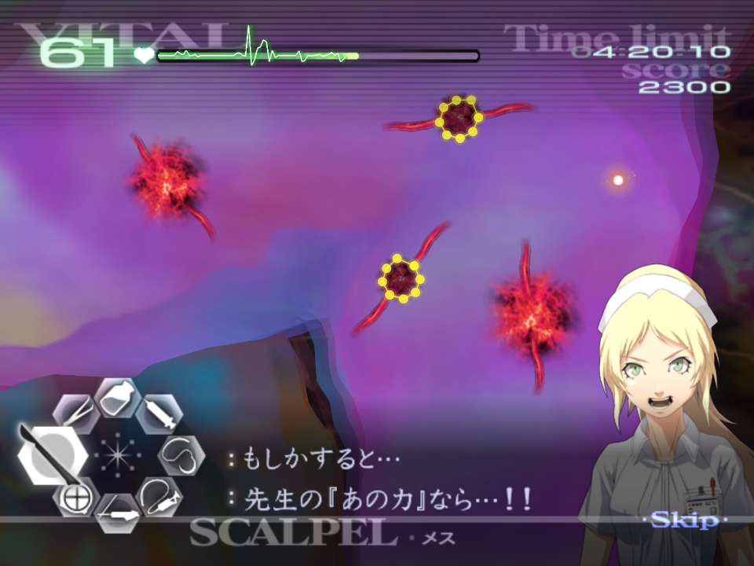
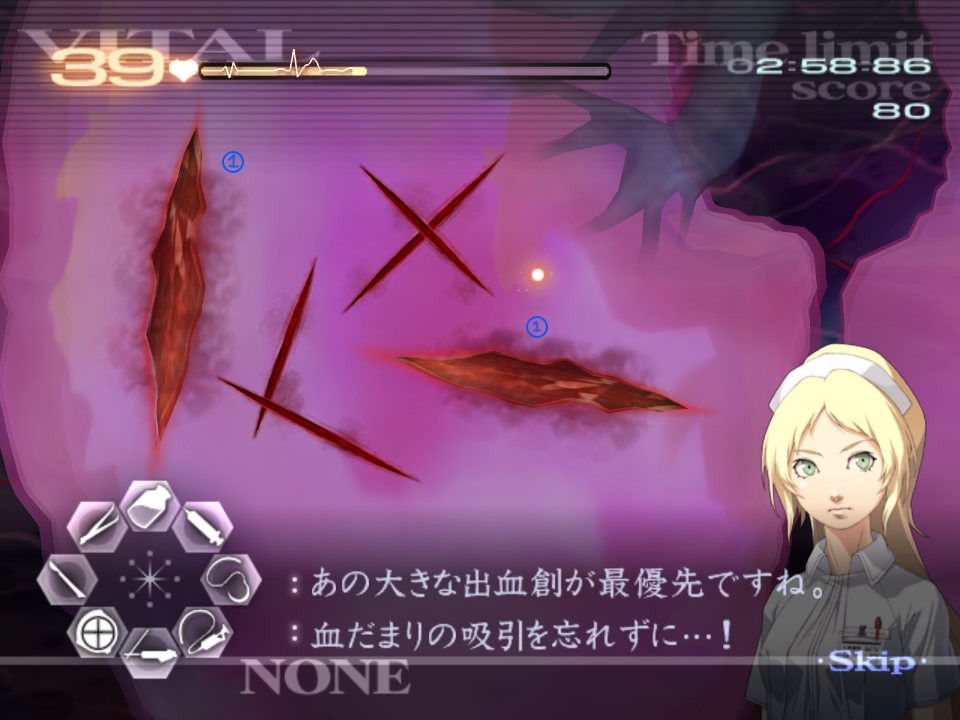
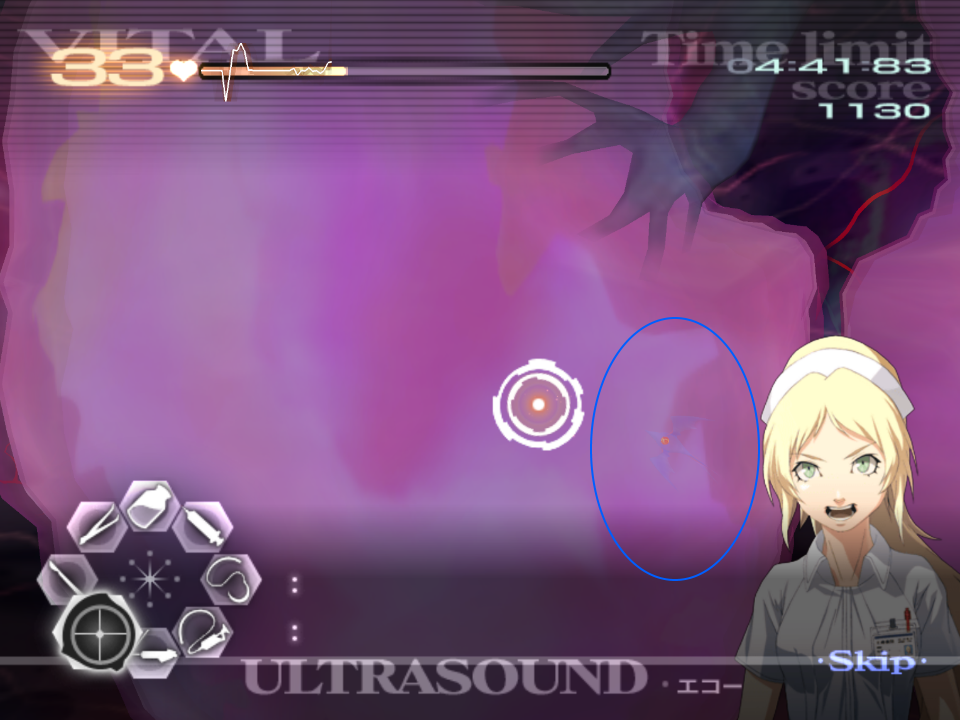
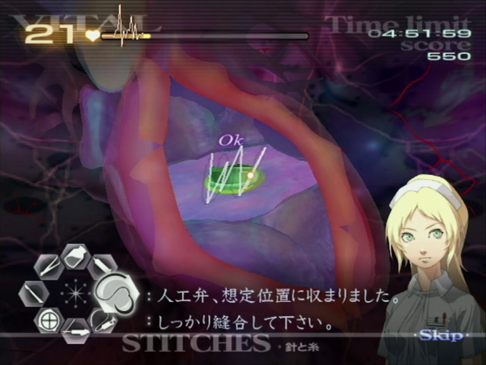

# Chapter 2

[Back to Main Page](../index.md)

## 2-1

This operation is perfect for improving your tool swithing due to the pacing needed to drain the thrombi as fast as possible.  
When the op starts, don't forget the initial zoom, you have to do another, once you open the patient.  
You should start with dealing the thrombus at the very top left corner, working down the organ in a counter-clockwise fashion.  
  
If you are especially fast, you might have to skip the second thrombi initially as it has a slightly delayed spawn. This means you must go for the third instead.  
If done at the right pace, you can ultrasound, cut and drain the last two thrombi together.  
  
After dealing with the initial five thrombi, wait for each thrombi to overlap in the outer vein, ultrasounding them as they travel so that you can pinch them in this location (shown below). After the Auto-HT activates, cut the group, drain them and tap the gel.  
  
There are an additional two thrombi to worry about, the very top left and the second to last branch at the bottom right.  
Deal with these as you did in the first wave.  

## 2-3*

Since this operation is nothing but drawing stars, the one important thing to note is that Derek will cut you off every time you complete a star. Hold ( C ) or ( Z ) so that any time the star icon appears you know you can draw a star.  
The rest of the below covers how to improve your stars, not just for this operation burt for any HT you need to activate in the rest of the run, making the critical for Savato.  
First, the game calculates stars in the same way as it calculates the sutures, meaning it looks for an angle change that is significant enough to create a line.  
The game can sometimes accept 6 line stars, however this is often because of an extra line that is insignificant enough, often at the tail of the star.  
You can still pop HT if you have drawn all 5 lines, but the fifth does not appear. Note that the line was drawn and upon letting go, the star activates:  
  
Regardless of where you start your star (top, bottom left, on the right, on the left) you should aim to keep it clean, even if it is a bit slanted or not completely perfect. The game doesn't expect you to be perfect, and in fact having some overlap of the start and end points can mean your star counts.  
From experience, **wide** stars work better than narrow ones. Not entirely sure why, but if the star is wider you're more likely for it to work.  
Play around with the starting position, for example, I prefer starting my stars at the top, as it is in the active area of the operation where you will b working, and you end in the same position. This way I also create more consistent stars.  

## 2-4

Just like in 1-5, you should premptively zoom the cameara into each area before the aneurysms spawn in. They will always be in same location every time you complete the operation.  
For the first aneurysm, you only need around half of an injection to sedate it. Don't forget about draining teh blood after you extract it onto the tray.  
After the first aneurysm, move the camera to the left and boost the vitals up to max. Drawing the serum here will be a waste as Angie will cut you off. The next aneurysm only needs about a quarter to a half of a syringe.  
Premptively move the camera over to the right, and take a full draw of the serum. Here you will need to inject one and then the other. If you are fast enough you should be able to sedate both, and then excise them before it wears off. To do this, ensure you cut them in the same order you injected them.  
You won't be able to draw the sedative before the next wave, so move the camera quickly over to the left. You'll need a full draw, and a little more, so inject into both and top off the other one with some extra to sedate it. Like the previous wave, if you are quick enough you can cut both out before the sedative wears off.  
Move the camera to the right once more before the final wave, and ensure that the vitals are no lower than 50. Do not activate the healing touch. The intention here is to allow for two of them to burst. Treat the two centre aneurysms, as the other two burst the quickest.  
  
If you are especially fast, you can extract the aneurysms before the others burst, otherwise just wait a moment as they burst as not to get a miss and potentially kill the patient. From there, collectively drain and deal with each aneurysm as usual.  

## 2-6*

This operation is incredibly short, but there are still small optimisations you can employ.  
First of all, drain the blood of one of the cuts. Angie will briefly cut you off once you do. Then close the cut and suture it.  
Next drain the other cut, close it and suture. Angie will again make you wait a moment before you can suture the smaller cuts so keep this in mind.  
  
It doesn't matter which cut you start with first, but ensure you finish one cut before moving onto the other as collectively treating them is slower due to the cursor distance and tool switching efficiency.  

## 2-9

Like in 2-6, drain each cut, then close them and suture, as this is faster than collectively dealing with the large cuts.  

***Please follow the Kyriaki Advice found under [GUILT - Kyriaki](../guilt/kyriaki.md) for this operation. The below is operation specific advice.***  

After you suture the newly created cut, immediately ultrasound towards the centre of the operation area as this is often where the first immature will be.  
Note that this isn't always necessarily the case, and you should follow the general Kyriaki advice, but more often than not, the immature will be in this area.  
  
Once you kill the first immature and suture, you have a big enough window boost the vitals with two full injections. This is close, and it is better to go for one and a half if the first cut appears.  
There is a cut that will spawn but trying to suture it before Greg cuts you off is tight. Aim to squeeze this suture in after the vital boost.  
The next cut always spawns right next to the tool wheel. Don't forget there are two immatures here.  
When you reach the final wave, you should aim for 40+ vitals.  
You've got to wait a little after Kyriaki dies, so you can always boost vitals here to ensure they are at safe levels.  
Greg and Angie will cut you off when you go for the final suture of the patient.  

## 2-11

The line on the heart doesn't need to be gelled, but it makes it a hell of a lot easier.  
The defib will start the frame you select the scalpel.  
During the wind up for fibrillation, pull your Wiimote back, so that you can immediately push this forward for the defib.  

*With HT*: you should pop HT right after the transition finishes to open the heart, this way there is no lag on the blood particles. You can then drain, cut, and place the valve, and suture. You will need to guess where these go as the blood will cover it up.  
If even this is not enough time, activate the healing touch **before** using the scalpel to open the heart.  

*Without HT*: it's possible to just go really fast here, but it is very tight and considered an advanced strat. Same as usual, just that you can only really afford one or (maybe) two mistakes.  
  
Given the sutures are wacky for the valve. You should do vertical sutures (going up and down) across the valve. For the heart itself, just suture across the entire opening.  
