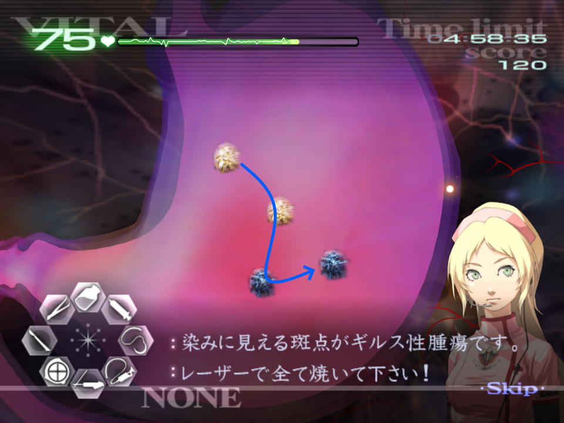
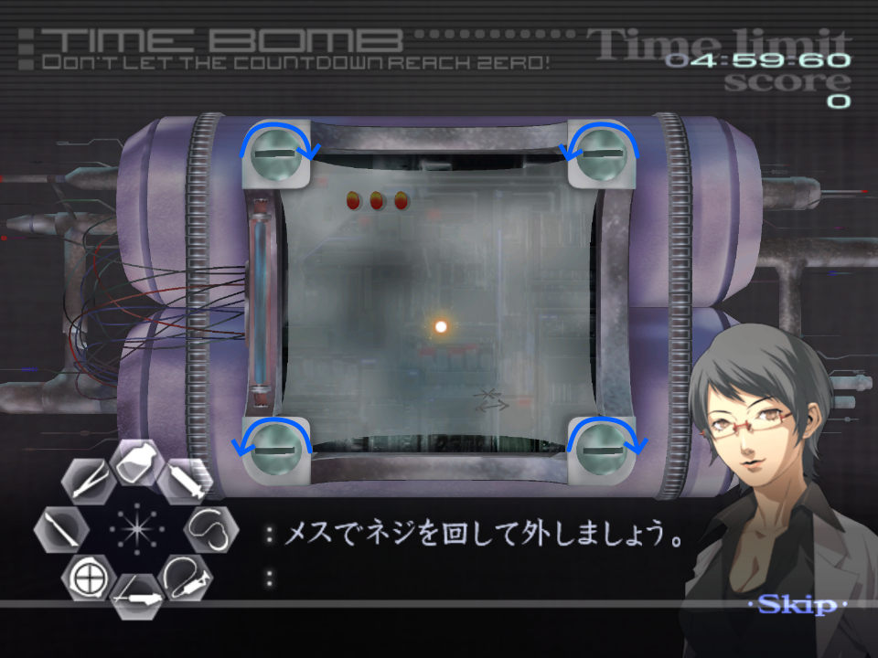
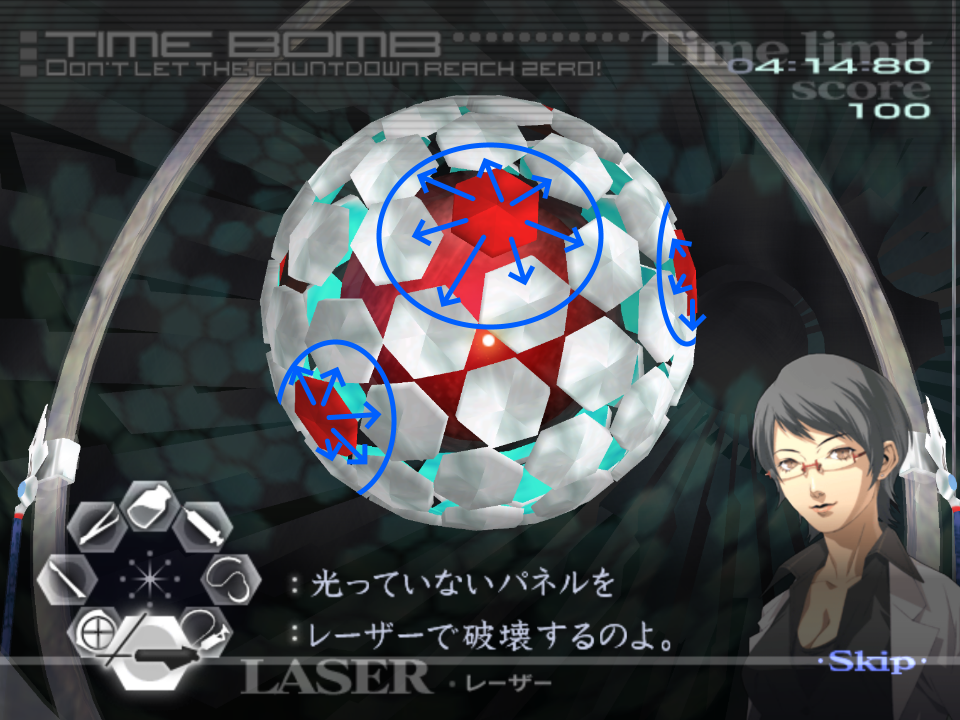
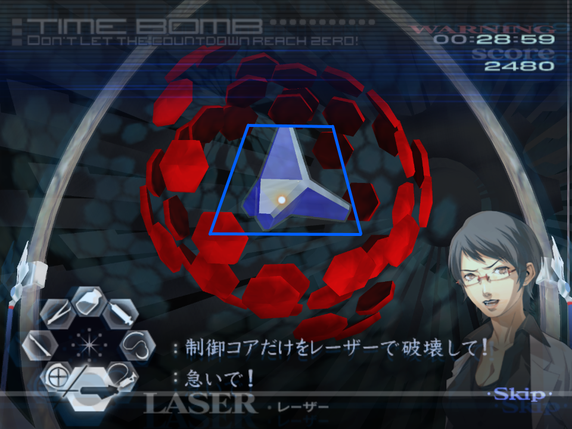
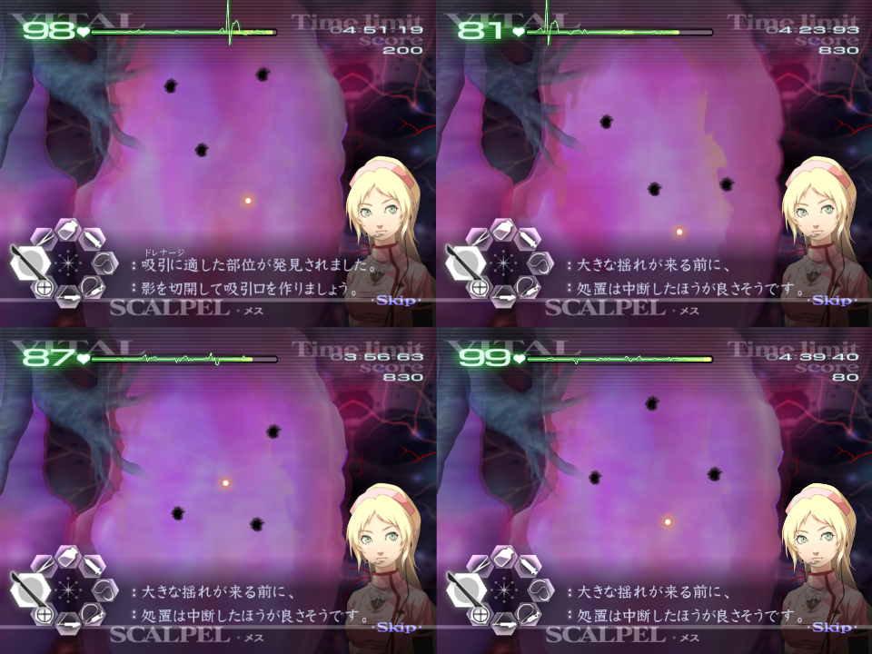
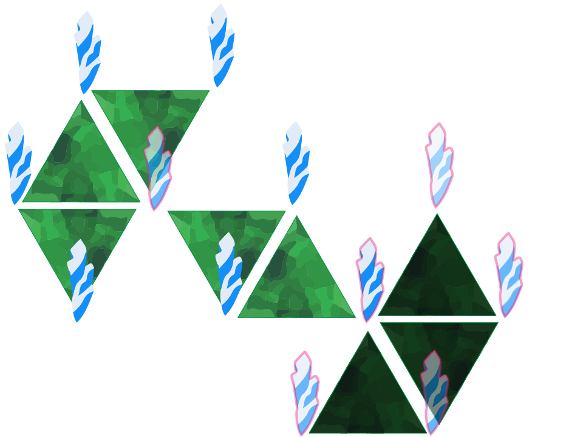
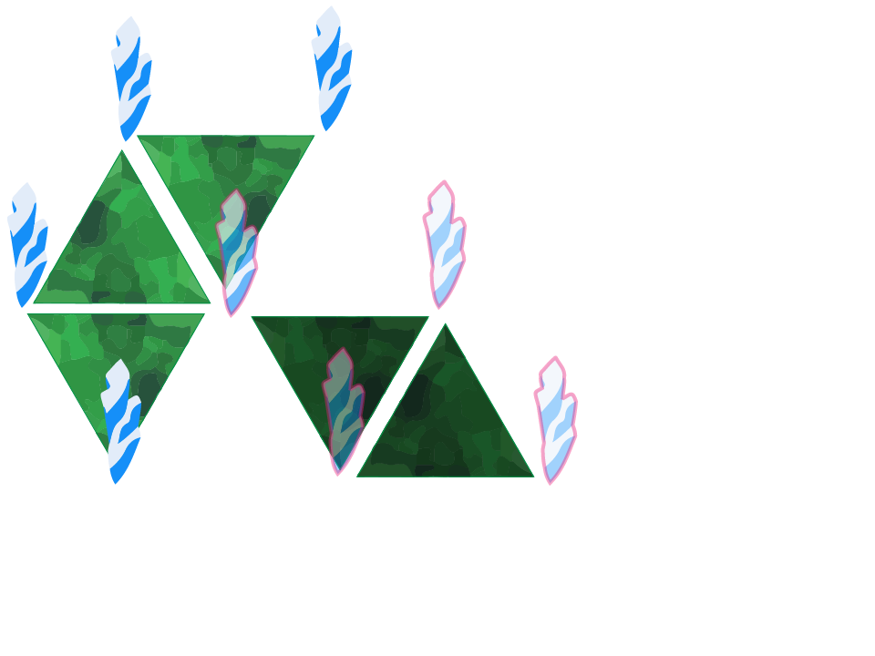

# Chapter 3

[Back to Main Page](../index.md)

## 3-2*

With the big lacerations you should drain the blood of one cut, close and suture before you deal with the next.  

***Please follow the Kyriaki Advice found under [GUILT - Kyriaki](../guilt/kyriaki.md) for this operation. The below is operation specific advice.***  

There are quite a few long waits between waves, so you can boost vitals if necessary.  
After you finish dealing with Kyriaki, and you close up the patient, you will have to awkwardly wait for Sydeny to stop talking to Angie about Chirality to be able to finalise the operation.  

## 3-4

In the pre-op there is a quite a bit of time so spend this time to stretch!  

***Please follow the Deftera Advice found under [GUILT - Deftera](../guilt/deftera.md) for this operation. The below is operation specific advice.***  

The tumour locations are always the same in small clusters, there is no set order to laser these in but this is the order I take:  
  
After lasering all these tumours, you have enough time to complete a full injection of the stabiliser before Angie talks.  
You will likely have enough to max the vitals while you wait for the first pair of Deftera to merge.  
The vitals do not get boosted once you move onto the lungs. Keep this in mind in case you are low.  
You can boost vitals again while you wait for Deftera to spawn on the second stage.  

## 3-6
The screws have set rotations of about 180 degrees, and you should start from the top left. While the operation loads in, twist your wrist and wiimote to the left, so you can unscrew the first screw. From here, alternate each direction for each screw going clockwise around the bomb:  
  
Once opened, the fastest method to move the pegs is to place the top right peg in the first position on the left, followed by the pin below it being placed in the third position on the right:  
  
The red panels here will flash three times, and on the fourth they will move to an adjacent panel.  
You have one miss available, so if you hit a red panel or miss and hit between the panels, slow down and breathe. It's better to go slightly slower than risk another miss in a full-run.  
If you hit a red panel, it will delay when it moves by a little bit. Just keep this in mind if you recently hit a red panel.  
The safer stat here is to laser all the white panels free that are two tiles away from any existing red tiles. This way you aren't likely to hit a red panel as it moves.  
  
As the panels rotate around the core, aim to laser in the same direction, for example if the core is roating upwards, aim to lasers from bottom to top; if the rotation is from left to right, do the same. This way you maximise how many panels you can hit.  
As you approach the last set of panels, keep in mind that a red panel may suddenly appear, do not rush too quickly if you know the panels are due to move.  
You should aim to avoid leaving solo panels, as there is no way to read whether a red panel is going to move onto it, or to allow for a red panel to move away. This however becomes inevitable as you laser off most of the panels.  
For the final phase, pop HT immediately, and laser between the panels to hit the core until it breaks.  
For a slight improvement, aim to buffer the star by holding your cursor still until you see a gap forming in the panels, this way you don't have to wait as long.  
The core itself is a bit larger than you think, meaning you can laser just under it and damage will be dealt.  
  
It is safer to wait, than to try to rush and laser through a very risky gap!  

## 3-8* [Hard]

First thing to note about this operation is you should play it on ***Hard.***  
This is due to the reduced waiting times between cycles. If you are struggling to meet these however, run on normal, though you lose around 20 seconds.  
If all edema are drained within a wave, you only will need to deal with four waves total. You can only deal with three drain points in a wave. There are set locations for these drain points:  
  
When trying to identify a pattern, aim to ultrasound an area, and upon identifying the pattern cut each point one by one. ***Do not cut all three at once as this drops the vitals massively.***  
The ideal location to ultrasound is either towards the lower right area, or middle-left area in hopes of hitting at least one drain location.  
On the second to last wave, you can perform an early ultrasound right as the turbulance is due to hit. There are six shudders before the turbulance hits, with a small delay. If you ultrasound just after the sixth shudder, the turbulance will start and the drain point might be revealed. If it isn't, you know it isn't this pattern. This saves a very minimal amount of time. An example of this can be found [here](https://youtu.be/KhW5w_KtEoo).  

## 3-10

Be sure to switch back to Normal (if running Normal/Easy difficulty) after 3-8.  

***Please follow the Triti Advice found under [GUILT - Triti](../guilt/triti.md) for this operation. The below is operation specific advice.***  

It's possible to just pull out all the thorns and then all the triangles of Triti without using the Healing Touch here. This requires you to be consistent and confident you can do this.  
Angie and the Head of Caduceus Europe will cut you off when you first select the forceps, and then again when you have dropped off the first thorn.  
If you don't want to use HT, you should opt to remove the below thorns first:  
  
From there, you can then remove the right-most three triangles.  
Next, you can remove the thorns surrounding the centre two triangles, and remove them afterwards.  
  
Finally, you can remove the last set of thorns and the final three triangles.  

---

← [Chapter 2](./chp2.md) | [Main Page](../index.md) | [Chapter 4](./chp4.md) →