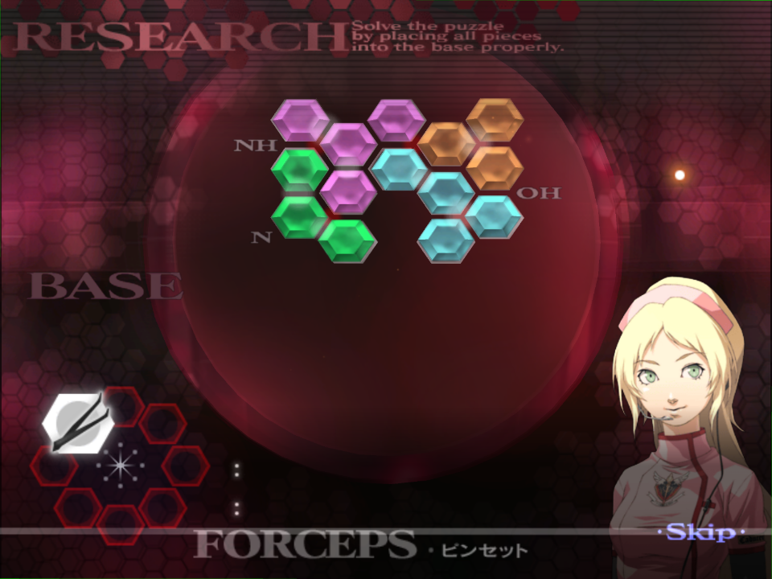

# Chapter 4

[Back to Main Page](../index.md)

## 4-2*
The main thing to note for this operation is not to ESS after any of the operations. If you do for the first two, you'll lose your progress. Each patient is a minute or so long.  
The locations for this operation are fixed, and should be completed in this order:  

The first two operations will be nearly identical, only the third operation is slightly different.  
Each injection requires only a quarter of the vial, it's a very small amount.  
The ideal routing to get the sample from each one as quickly as possible is to first inject after opening the patient, then wait for it to dive. Ultrasound and cut it out as soon as possible, then draw and inject the serum, and while you wait for it to dive again, gel the cut.  
If you are feeling daring and extra fast with your tool switching, you can save a small amount of time by placing the sample on the tray, switching to the scalpel, cutting, and then draining before the delay kicks in. This is super tight on timing, and realistically you should just aim to drain some of the sample before this kicks in.  
On the final sample you retrieve, it'll go bonkers with gas. You can just wait this out. To be extra optimised, you can try to gel it to make it slow down close to the tray.  

## 4-4
While in the pre-op dialogue you can take this time to stretch.  
***Please follow the Tetarti Advice found under GUILT - Tetarti for this operation. The below is operation specific advice.***  
The diverticula are always located in the same spots, and same colours every time.  
You should inject all three of these before cutting and extracting, as this reduces the amount of serum you need to inject overall. Start with yellow as this is the first to get bigger, then green, then purple.  
  
Like tumours, you should tap the gel on each of the membranes.  
Once all gelled up, you can inject a full draw of stabiliser while waiting, Angie will cut you off anyway.  

## 4-6*
You'll need to do each step from Victor in a set order: Scalpel, Laser, Gel, Syringe.  
On the injection stage, you will need a full draw of each type. On the first phase, the injection order goes from right to left.  
If done optimally, you can get three injections on each phase before the core moves. If you aim to go for the third injection, be sure to time it so that you do not get a miss as the core moves.  
On the second phase, if the vitals are too low you will need to boost them to 75.  
The order is: Blue, then Yellow. Purple, then White.   
It is possible to inject just before the core moves, however this runs the risk of Victor yelling at you and having to redo the injection.  
After the second white injection, select the scalpel and begin to cut in the below area as the core will always be here:  
  
Be ready to drop the core onto the tray after cutting it out.  

## 4-7*

The puzzle has a set solution, found below.  
I highly recommend completing the puzzle the same way every time for consistency, so that you can eventually do it without reference.  
  

## 4-8*
You'll need to inject the nanomachines three times before the core is exposed. Each injection must be a full dose.  
Like in the research stage in 4-6, you can inject this three times if you are quick enough. 
You do not need to laser the tiny tumours but doing so can stop the vitals frop dropping too much.  
On the second phase of injections, be careful as the core might move after your first injection.  
After the final injection start cutting in the below area to cut out the core, as it will always be here.  

## 4-9
The puzzle solutions are always the same, see below for each.  
  
You should aim to complete the puzzle in the same order for consistency, that way you can also complete it without using a reference.  
  

## 4-10
Unlike in the research stages, to expose the core, only two injections of the nanomachines is needed.  
***Please follow the Pempti Advice found under GUILT - Pempti for this operation. The below is operation specific advice.***  
Even if you play optimally, it's very *very* tricky to laser all the mini blue cores on the initial showcasing wave, so aim to laser the four cores working from the left, leaving the furthest on the right. This is due to Victor and Angie talking.  
  
At the end of this operation, be wary of Victor talking meaning you have to delay your suture by about half a second.  