

# Chapter Z

[Back to Main Page](../index.md)

## Z-1

For less cursor movement and optimised tool switching, you should drain the blood on the left, then the top, before draining the cut on the right, and gelling right away. This saves you from moving your cursor.  
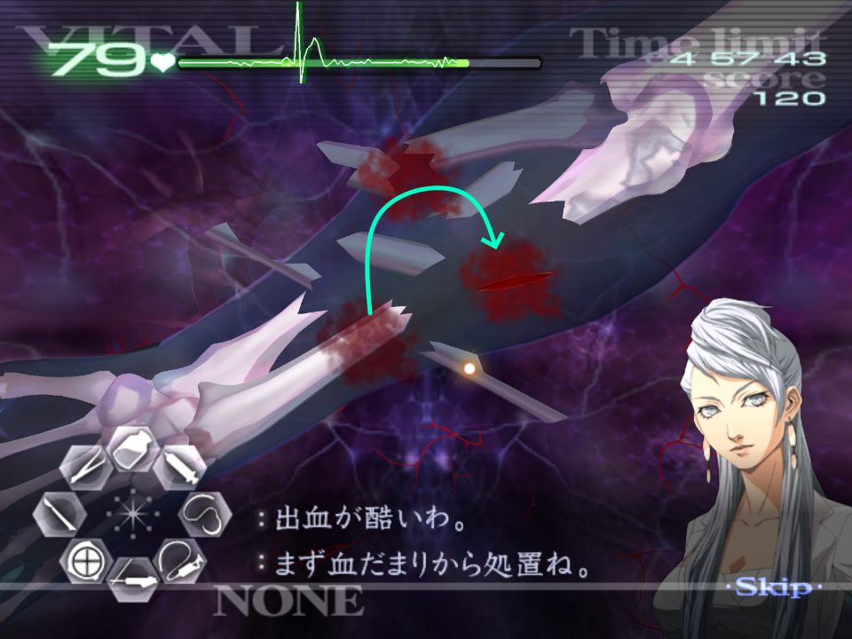  
The order in which you pick up the bone-fragments are the same order you'll need to set them down. For this reason you should always pick up the fragments in the same order for consistency - you should eventually reach a point where you no longer have to look at the piece to know where it will go. As an example:  
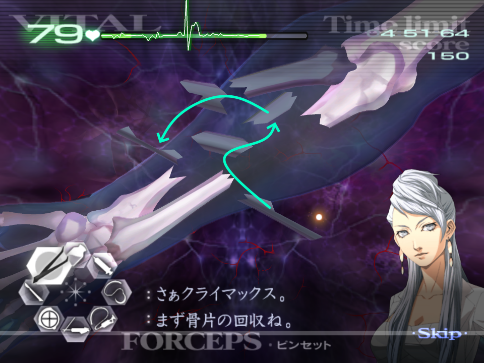  
Trying to get the elbow to line up can be tricky, below is the resting point to help guide you.  
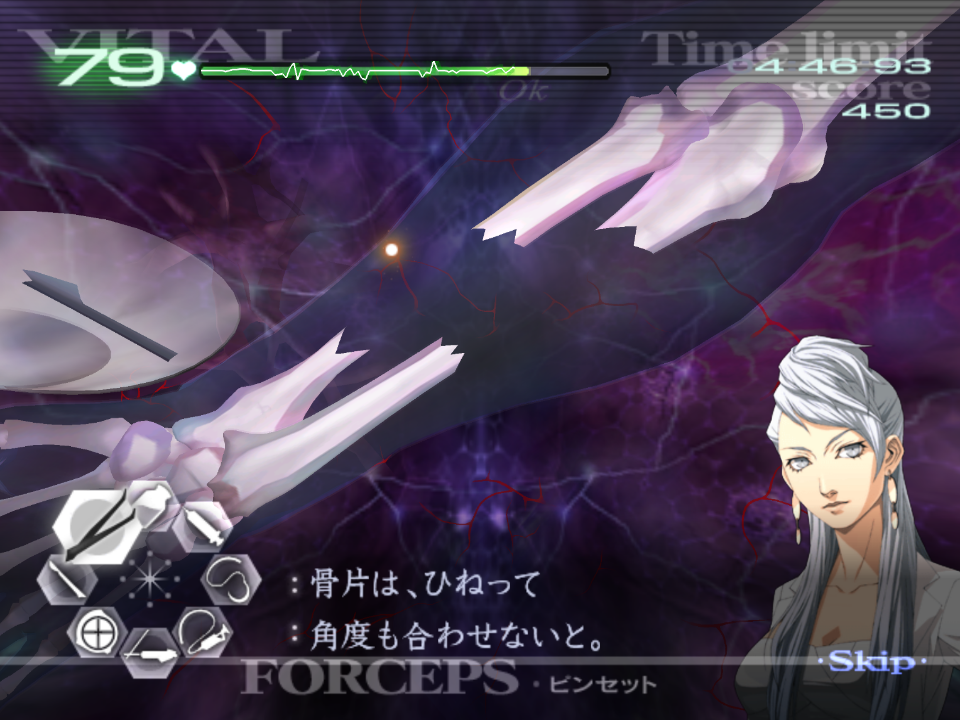  
The rotations on these bone pieces are a bit awkward, and letting go for A or B can jostle your hand too. The most comfortable way is to premptively rotate your hand in the opposite direction, pick up the piece, then bring your hand back to the normal rotation, and drop the fragment.  
The final bone-fragment will always be located here and you can simply cut it without using the ultrasound first.  
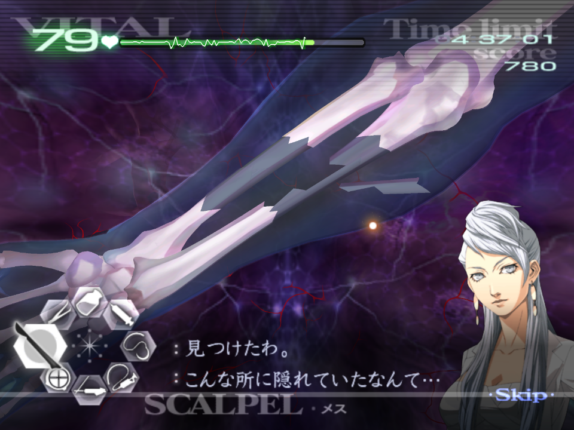  
This piece can also be dropped without rotating your wrist, as long as it is dropped centrally to the gap where it belongs.  
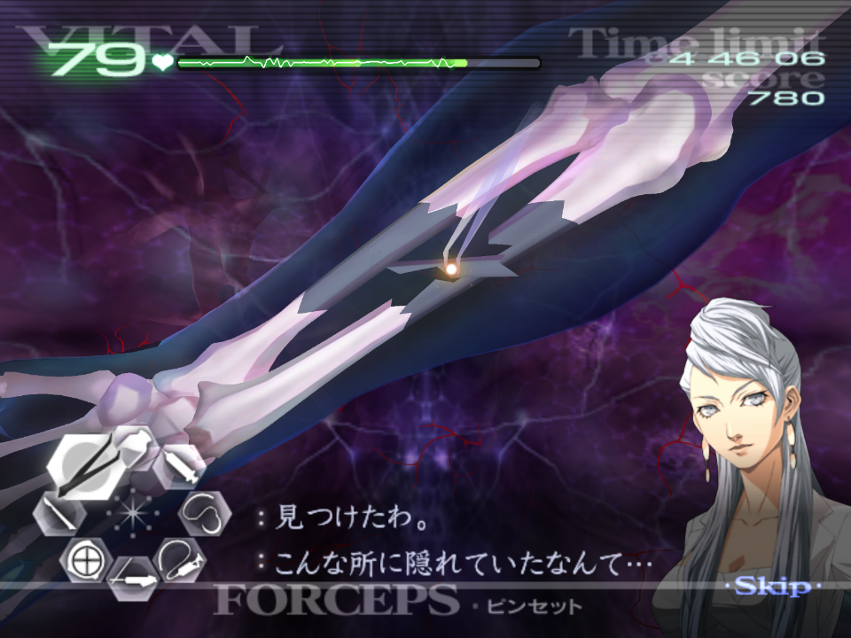  

## Z-2

It's worth noting that you shouldn't need to worry about the tumours regenerating as the timer is quite fair on Normal.  
If you are concerned about the vitals dropping too quickly, you should cut two of the veins to each tumour, then cut the final veins collectively and extract.  
The tumours are always in the same locations, and so are their rotations.  
Aim to deal with the tumours first, followed by the polyps/small tumours.  
The vein hitboxes only start about a third away from the tumour, so be sure not to cut too close:  
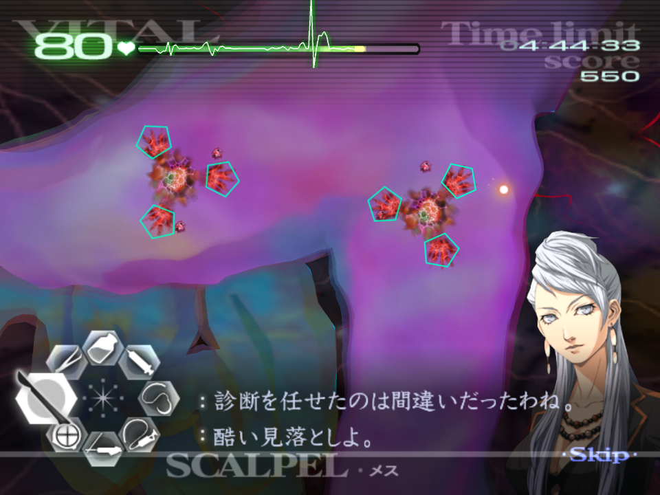  
As long as the vitals aren't too low after the pair of tumours in the second wave, you should be okay.  
Before Naomi activates her Healing Touch, you can drain one of tumours but she cuts you off:  
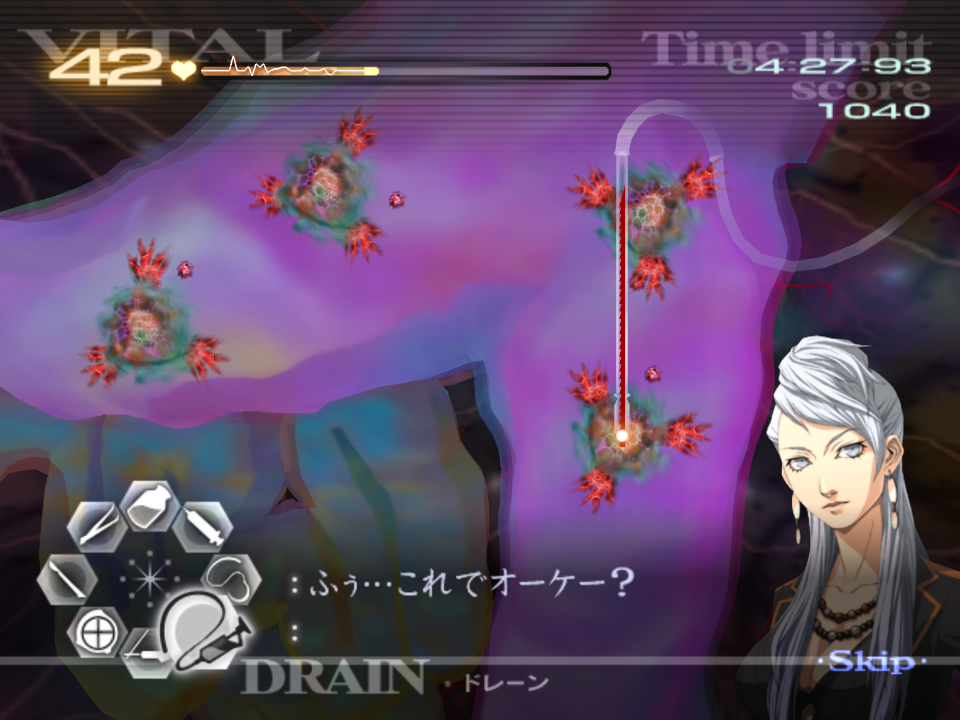  
Keep in mind the blood will stop you from gelling when lasering the small tumours.  
You should laser these in clusters, (ie: per vein) and gel, to prevent extra bleeding.  
With HT active, you should be able to cut each vein for the tumours, then extract and have enough buffer.  
If you are worried about the vitals falling if you are slower, or you worry you might drop a tumour, cut two veins per tumour, then all of the final tumours at once, and extract.  

## Z-3*

At the start of the operation, you need to first reveal the three cuts at the top right of the chest for you to be given access to the sutures.  
After the first cut, Naomi will talk a little and you'll be given access to the rest of the tools.  
All the effected areas are stationary and the same every time, so it is possible to deal with each area without moving the penlight. This is ideal to avoid wasting time as you move the light.  
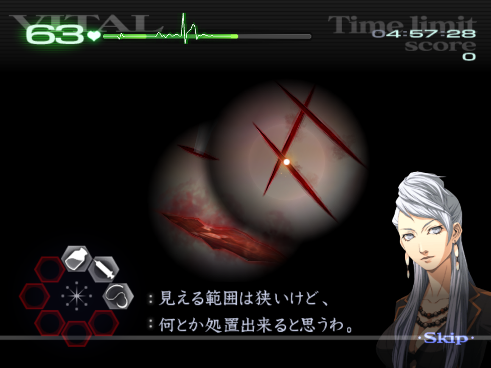  
If you leave the penlight in the second area (on the left in the image above), you can only see the edge of the wounds, but you can still deal with these even if the light is not on them.  
You can use Naomi's Healing Touch if you are worried about the vitals, but you should be safe not to need it if you are reasonably quick.  
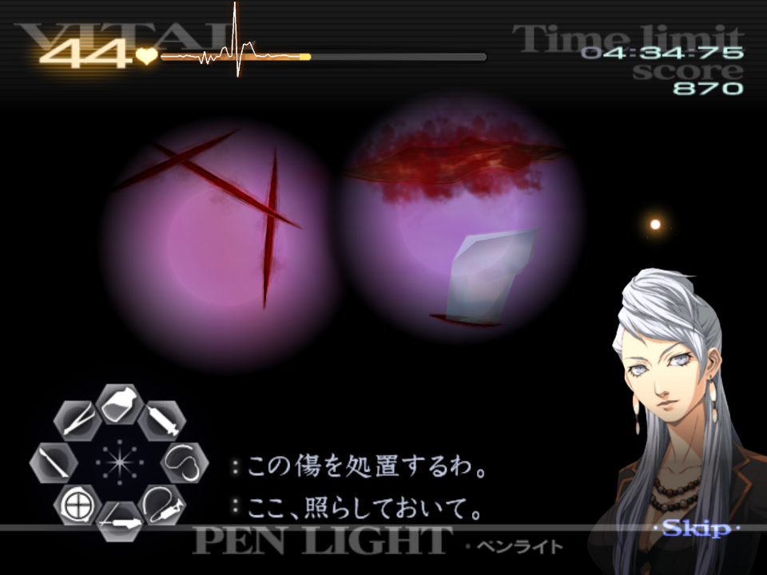  
In this final area, if you are quick enough you can suture these three cuts on the left before the light goes out.  
It isn't necessary to use the camera flash if you can memorise the location of the large cut, glass, and laceration on the right.  
Using the camera here is considerably slower, so aim to memorise these areas.  
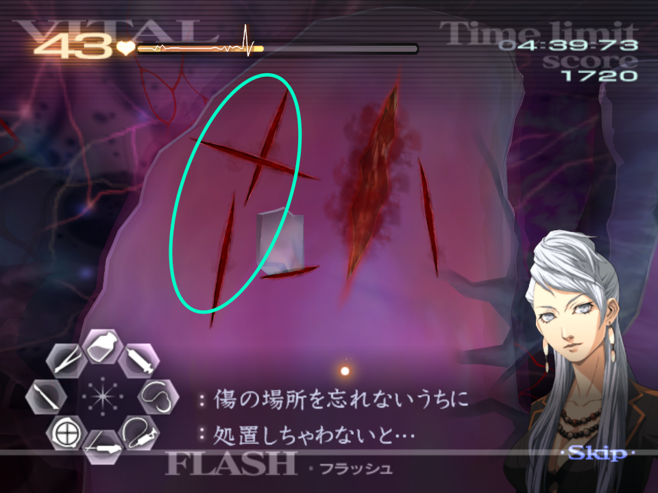  

## Z-4

Given that the vitals are already kind of low, and if you worry about potentially dropping one of the tumours, pop Naomi's HT before extracting. For a quicker approach however, extract the two tumours, then pop HT.  
These large tumours are always located in the same place.  
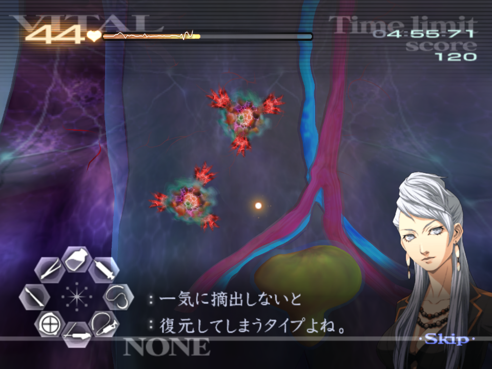  
After extraction, if you have not activated Naomi's HT, do so now.  
You should sedate both the artery (red) and vein (blue) with one and two thirds injections each.  
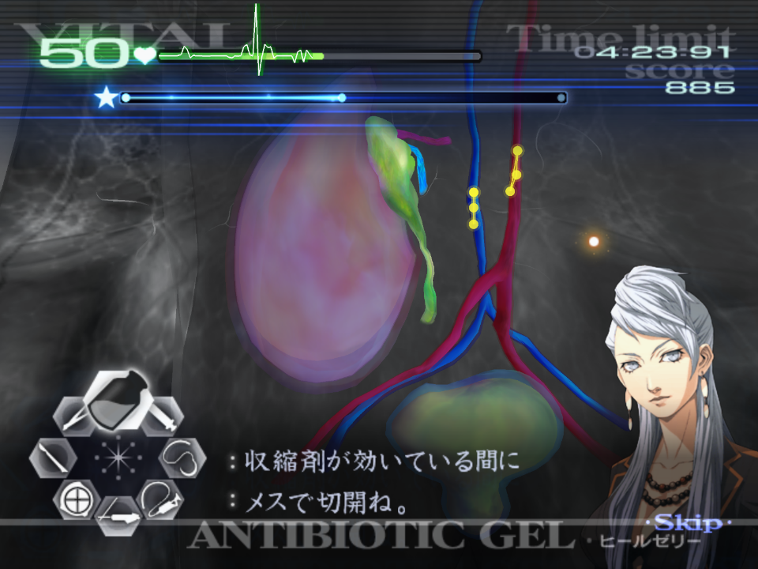  
After sedation, you should cut both of these points, then connect the tissue up. You should connect the artery first, and suture. The artery will take priority if you connect both of these up, as it is "above" it.  
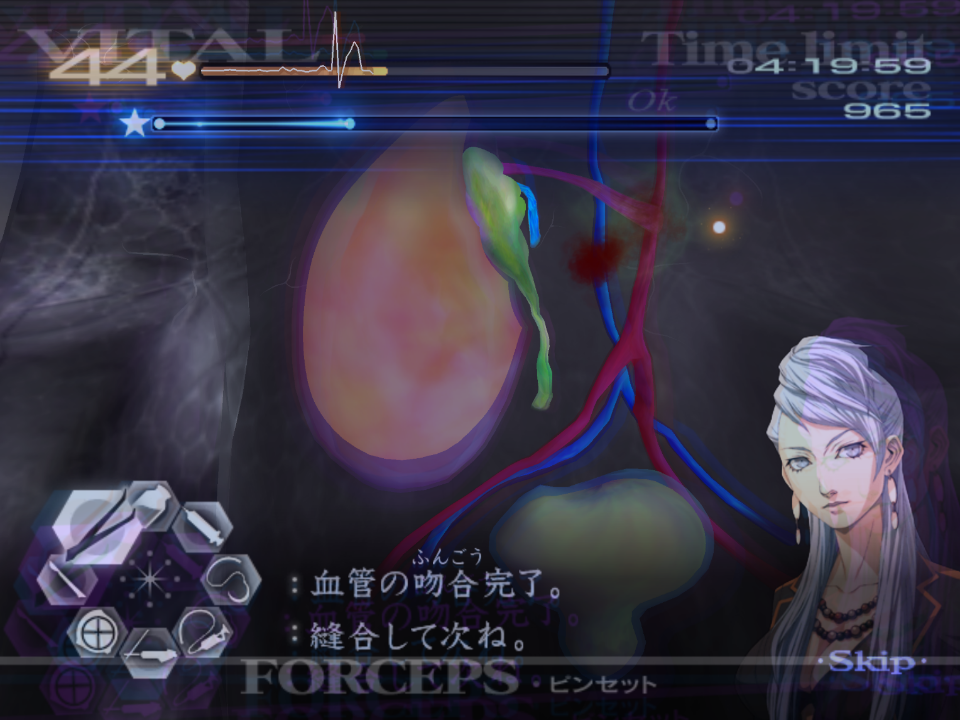  
When suturing the bladder, aim to do a vertical (up and down zig-zag) to close this.  
The wait here for the sedative to wear off isn't consistent, and will depend on how long you take. Expect to wait anywhere between 5 and 10 seconds.  

## Z-5

***Please follow the Kyriaki Advice found under GUILT - Kyriaki for this operation. The below is operation specific advice.***  
To start, deal with the cuts and the triple Kyriaki that follows. Note that it takes three hits with the laser to kill an immature.  
Suture the cut that the Blue Savato pour out of, then pop Naomi's HT.  
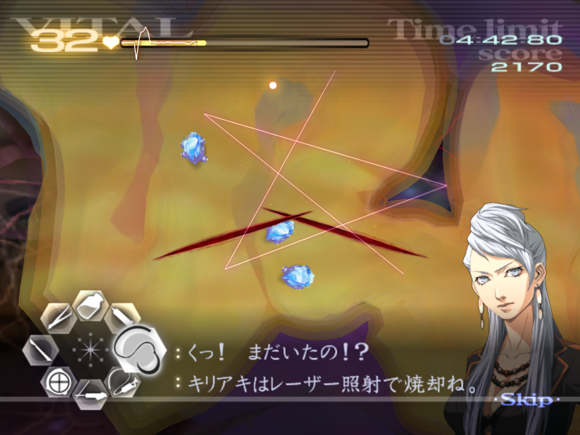  
Proceed to deal with Kyriaki until it is defeated, ignoring the Blue Savato. Hitting the Savato with the laser means you'll get cut off by Little Guy.  
You only need to retrieve **one** Blue Savato, so inject one, place it on the tray and kill the other two.  
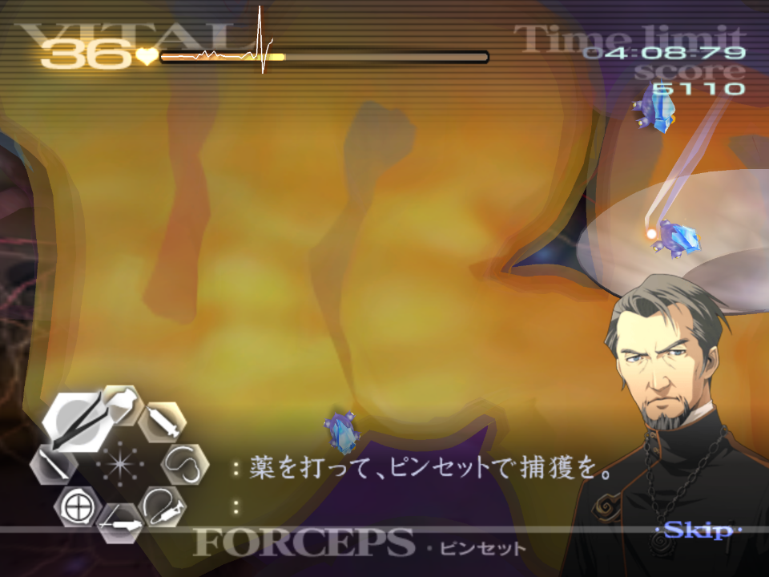  
When attempting to inject the Blue Savato, you'll need about 3/4 of the syringe to sedate it, and it must be given in one dose. You should aim to inject one that is stationary, to avoid a miss.  
If you do go for one that is moving, give it as much lead as possible to allow you to inject it in full.  