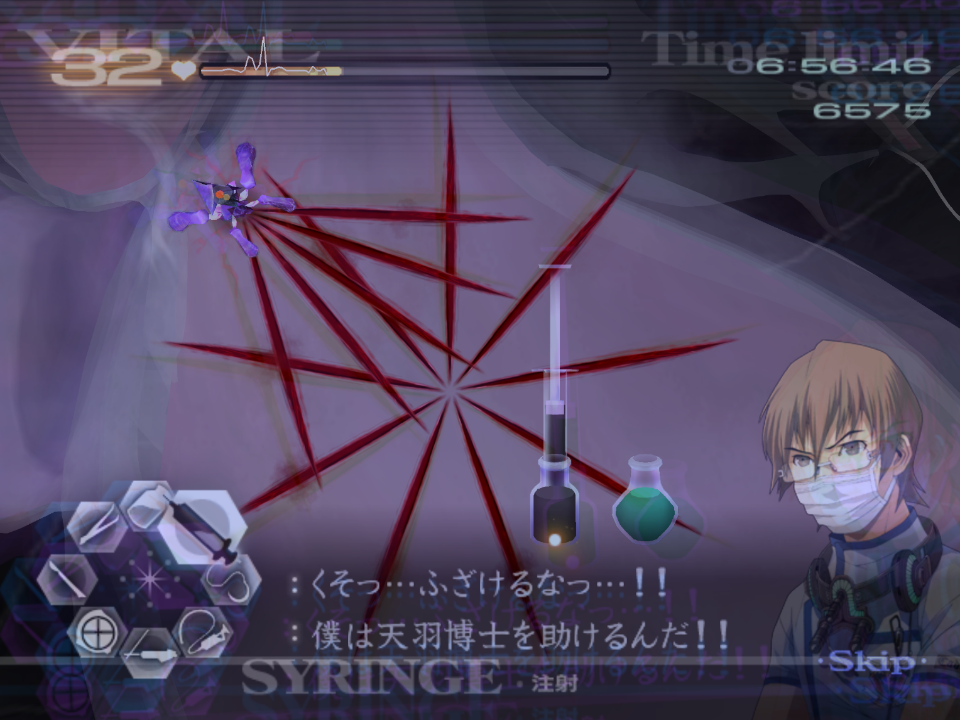

# Chapter 5

[Back to Main Page](../../index/eng/index.md)

## 5-2*

***Please follow the Kyriaki Advice found under [GUILT - Kyriaki](../../guilt/eng/kyriaki.md) for this operation. The below is operation specific advice.***  

Given that this episode is five back to back Kyriaki patients, this will seriously test your tool switching, pacing, vital management, and overall speed.  
If you have a healthy pace, you should only need to boost vitals on patient two, and five.  
Each patient ramps up in difficulty (approximately). Patient one has one starting immature, followed by another two in the next wave, and finally the mature in the final wave. Patient two will have two immatures in the first wave, followed by three in the next, and finally the mature. Patient three will start with two immatures, then two in the next wave, and the mature will be accompanied by an immature as well. Patient four will be the exact same. Patient five will start with three immatures, then an additional two, as well as an extra immature with the mature.  
Do not bother boosting vitals between patient as they reset to max (99).  
If you kill a patient, you will have to re-do the entire operation, so it is better to be slightly slow and safe than rush and kill the patient.  

## 5-3*

***Please follow the Triti Advice found under [GUILT - Triti](../../guilt/eng/triti.md) for this operation. The below is operation specific advice.***  

The pattern for Triti is always the same, and I recommend using the Healing Touch in this op.  
Despite being split into two clear areas, you should extract all the thorns and triangles in one go, not touching the triangles until the thorns are out.  

## 5-4

***Please follow the Tetarti Advice found under [GUILT - Tetarti](../../guilt/eng/tetarti.md) for this operation. The below is operation specific advice.***  

The diverticula are located in the same locations every time.  
You should deal with Yellow first, then Green, then Purple, as this is the same order they expand in.  
  
Just like in 4-4, you should inject all three before excising them.  
You should tap the gel on the membranes.  
There is enough time while you wait to boost the vitals while you wait for the Tetarti to appear.  
Despite Angie's comments about it being mutated, the only difference is you will need to complete more waves overall.  

## 5-6

***Please follow the Paraskevi Advice found under [GUILT - Paraskevi](../../guilt/eng/paraskevi.md) for this operation. The below is operation specific advice.***  

After dealing with the two small cuts, there is enough time to boost the vitals to max.  
The Paraskevi will spawn near this middle area, with the tail located near the bend in the intestine:   
  
Victor and Angie will briefly cut you off after stunning Paraskevi for the first time, be ready for this as not to try and cut the Paraskevi in half while they talk.  

## 5-8

Each of the cuts that the immature savato spawn out of are predetermined. There are 8 in total.  
It takes 5 immatures to spawn a larger "blue boi" that will cut the vitals in half.  
On each of the cuts, the immatures pour out of the centre, making it easy to snipe.  
For the first wave after suturing all the initial cuts, be ready to laser here:  
  
From here, be ready to laser for the next cut over here:  
  
Then be ready to laser for the third cut here:  
  
After this cut, wait approximately three second and pop the healing touch, just before the next cut appears:  
  
The next two are located right next to one another:  
  
  
The final two cuts happen very quickly. For best optimisation, on the final cut you should laser most of the immatures, but not all. Suture the cut, then finish lasering. This skips a small amount of text. But it's a very minor time save.  
  
  

## 5-9*

***Please follow the Savato Advice found under [GUILT - Savato](../../guilt/eng/savato.md) for this operation. The below is operation specific advice.***   

This first encounter with Savato is the tamer and less aggressive variant.  
It is possible to get faster web-skip in this op and skip the extra strand at the end of the final web phase. To do this, you will need to execute the scalpel glitch on the upper left strand cross over. Do this 10 times, then cut one of the other overlapping points. Repeat the glitch for another 10, before cutting the other strand overlap at the bottom right. You should be left with the final two strands on low HP, meaning if you continue to do the scalpel HT glitch, it will break.  
This skip is very tight, and can *only* be done on this op and *not* on Savato 2.  
  
For an easier time-save, after the final injection for Savato, before drawing the star, take a full injection of the serum, then draw the star. Savato shouldn't make any additional cuts in the time it takes you to complete this.  

---

← [Chapter 4](./chp4.md) | [Main Page](../../index/eng/index.md) | [Chapter Z](./chpZ.md) →