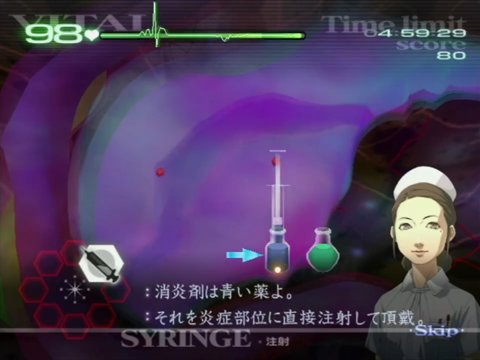

# Chapitre 1

[Retour à la page principale](../../index/fr/index.md)
	
## 1-1*

Prenez en compte les petits délais à chaque fois que Marie parle. C'est notamment vrai au début quand elle vous demande de suturer, et encore une fois quand elle vous demande d'utiliser le forceps.  
Vous devez suturer la plaie de gauche, puis celle de droite pour moins de mouvement de curseur.  
  
Après avoir retiré les éclats de verre, appliquez du gel en tapotant une fois sur chacune des petites plaies.  
Pour l'incision, vous devez vous assurer que tout est recouvert de gel avant de pouvoir sélectionner le scalpel.  
Parce que les trois coupures dans le bras sont assez proche, vous pouvez appliquer le gel en le faisant glisser sur ces plaies plutôt qu'en effectuant des tapotis.  
N'oubliez pas de mettre du gel avant d'appliquer le bandage.
  
## 1-2*

Quand vous allez injecter du stabilisateur, soyez sûr de prendre une seringue entière. Marie saura remarquer si ce n'est pas le cas !  
Tout comme l'opération 1-1, il y a un court délai à chaque fois que Marie parle.  
La tumeur est toujours située au même endroit (voir en dessous). Soyez sûr d'utiliser l'ultrason exactement où elle est comme ça vous évitez un dialogue supplémentaire de Marie.  
  
Couper la tumeur peut être fait de n'importe quelle ligne droite, ça n'a pas nécessairement besoin d'être fait verticlament. Dans le cas présent, faire une petite coupe verticale est le moyen le plus rapide.  
Après la membrane, juste tapotez une fois le gel au milieu de la membrane. Vous devrez faire ceci pour toutes les membranes suivantes dans le jeu.  
N'oubliez pas que vous pouvez juste appliquer le bandage sans mettre de gel au préalable à partir de maintenant.
	
## 1-3*

Les inflammations n'ont seulement besoin que d'un quart de seringue, juste là où le piston de la seringue atteint le bord du flacon (voir en dessous).  
  
Les tumeurs sont toujours placées au même endroit (voir si dessous) et vous n'avez pas besoin d'utiliser l'ultrason avant de les inciser.  
Quand vous exposez les tumeur au scalpel, vous pouvez le faire de manière individuelle pour chaque tumeur ou faire une sorte de forme de V pour toutes les exposer en un mouvement.  
  
Après avoir drainé chaque tumeur, coupez-les dans l'ordre opposé à celui que vous les avez drainé (à savoir, drainez 1>2>3 puis coupez 3>2>1). Si vous n'êtes pas assez rapide pour le faire, coupez-les simplement dans l'ordre dans lequel vous les avez drainé.  
Encore une fois, pour le gel, mettre un tapotement au milieu de la membrane est la meilleure solution.

## 1-5

C'est l'une des premières opérations où vous pouvez considérer le fait d'ouvrir le patient sans appliquer de gel au préalable. Cependant, c'est considéré comme assez compliqué et sauve seulement au tour de 0.4 secondes sur votre temps. Tentez de le faire en entraînement mais ne vous sentez pas obliger de faire cette stratégie.  
Quand vous utilisez le laser pour détruire les polypes, essayez de viser entre les regroupement pour tous les détruires d'un coup (voir en dessous).  
Le quatrième polype causera toujours apparition d'une hémorragie, Angie vous fera la remarque, donc soyez prêt pour le dialogue et le changement d'outil nécessaire.  
  
Après avoir détruit tout les polypes et appliqué du gel pour chaque trou, anticipez et bougez votre caméra où le prochain regroupement de polype va apparaître. Ils vont apparaître alternativement en haut et en bas, avec un total de 5 zones qui finissent par le haut de la gorge.
	
## 1-6

Pour cette opération vous devez faire attention aux signes vitaux. Vous trouverez ci-dessous des expériences basées sur mon expérience, mais je vous recommande fortement de voir ce qui convient le mieux pour vous en terme de réussite générale.  
Vous voulez d'abord traiter les tumeurs. Elles sont toujours situées au même endroit et n'utilisez pas l'ultrason pour les exposer. Vous pouvez faire deux coupures diagonales pour les révéler par paire.  
  
Tout comme dans l'opération 1-3, vous voulez les drainer, puis les couper dans l'ordre inverse (1>2>3>4 suivi de 4>3>2>1). Le faire requiert précision et rapidité, et si vous n'êtes pas sûr, visez d'en faire deux à la fois.  
Si les signes vitaux chutent trop rapidement, cela veut dire que vous devez travailler votre précision avec le scalpel.  
Le plus rapidement vous traitez ces tumeurs, le plus sécurisé vous serez pendant l'étape des inflammations, et donc pas besoin de remonter les signes vitaux.  
Une fois que vous avez appliquer le gel sur les membranes, commencez à traiter les inflammations. Vous devez prendre une dose entière de seringue et l'appliquer avant de revenir pour en prendre plus, même si vous ne finissez pas de traiter l'inflammation. Quelques inflamations ont des hitbox qui se superposent, et vous pouvez utiliser ça à votre avantage pour en traiter plusieurs à la fois.  
  
Les inflammations entourées ont des hitbox clairement superposées, et sont recommandées pour être traitées en même temps. Cependant, ceci peut également être appliqué aux autres et ce n'est pas exclusivement là où elles se chevauchent.  
***On complète cette opération dans ce sens car les membranes prennent du temps à disparaitre. De cette manière on n'attend pas que les membranes ne disparaissent.***  
Une fois qu'Angie vous demande de vérifier avec l'ultrason, vous aurez besoin de l'utiliser 10 fois pour continuer, idéalement, sélectionnez l'outil avant qu'Angie ne vous le demande.
	
## 1-8

L'opération commence avec un défibrilateur, donc reculez votre manette avant pour que vous puissiez l'avancer une fois que vous avez besoin. Quand vous pressez B, vous pouvez vous remettre dans votre position de confort.  
Une fois à l'intérieur du patient, essayez de retirer tout les bouts de verre d'un coup. Les signes vitaux ne baissent pas assez vite pour que vous ayez besoin d'utiliser le gel directement. Ci-dessous se trouve une manière possible de le faire, mais faites ce qui marche pour vous.  
  
Après avoir retirer les morceaux de verre, tapotez chaque plaie de gel une fois car c'est plus rapide que de le répendre partout.  
Une fois ceci fait, vous avez un bref moment avant qu'un autre défibrilateur apparaisse, donc reculez votre manette. Ne vous en faites pas si les signes vitaux baissent car ils seront ramenés à 10 le temps du défibrilateur puis remontés après.  
Après le défibrilateur il va y avoir un autre tesson de verre, suivi de la main curatrice activée automatiquement et une plaie à suturer. Elle est une peu plus large que les autres donc vous aurez peut-être besoin de lignes supplémentaires pour finir la suture.

---

[Page principale](../../index/fr/index.md) | [Chapitre 2](./chp2.md) →