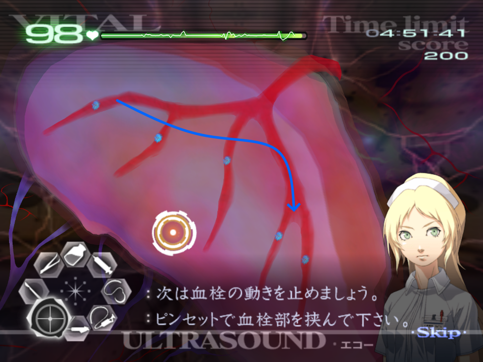
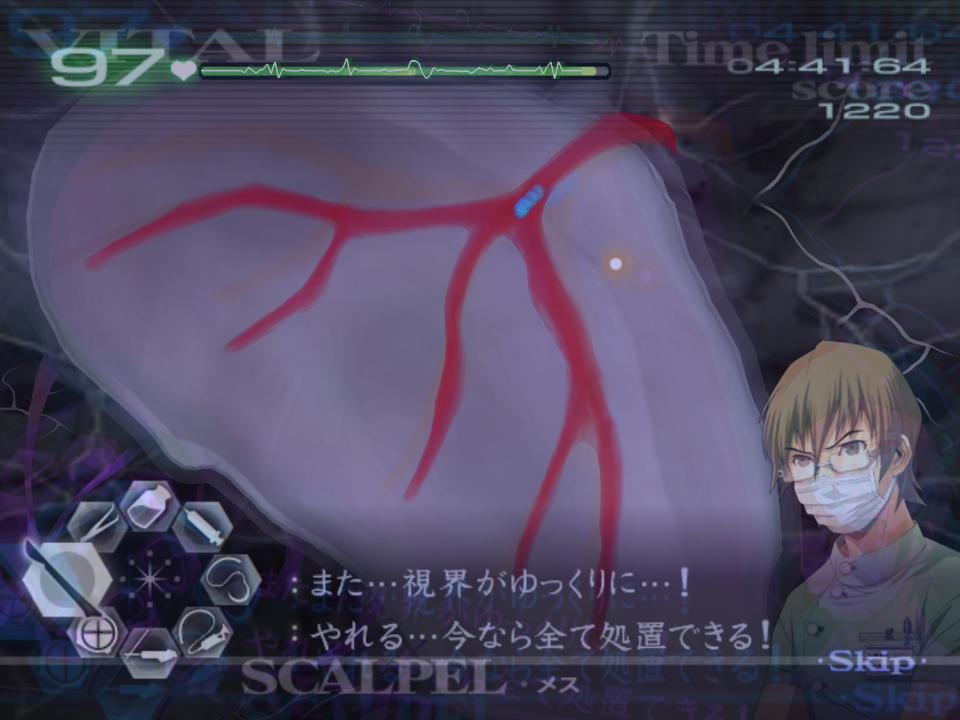
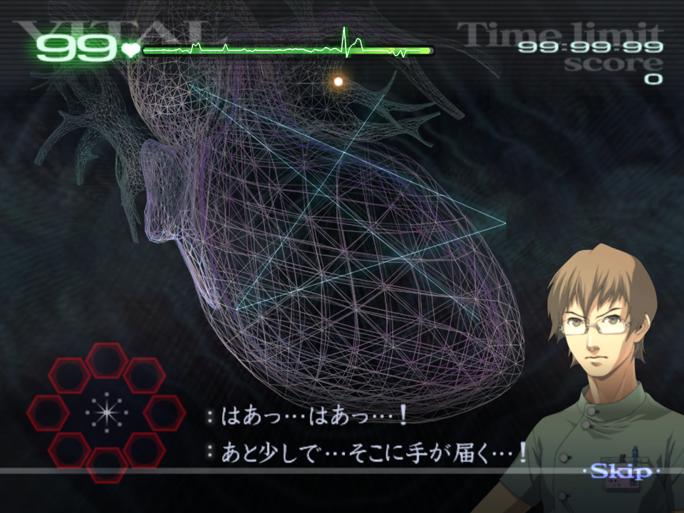
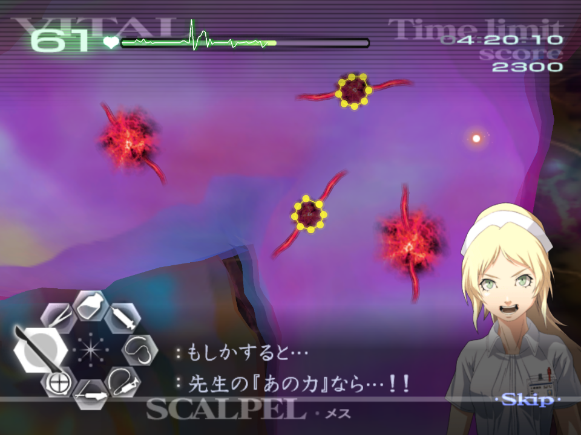
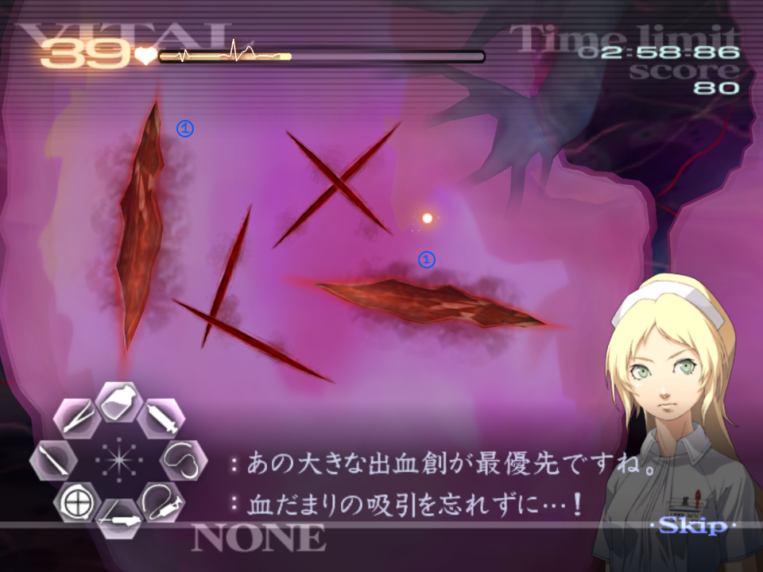
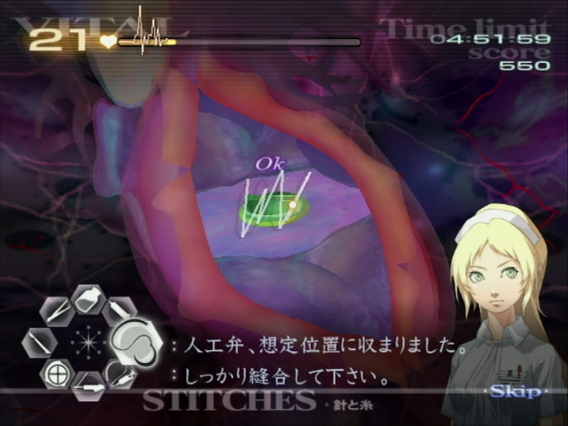

# Chapitre 2

[Retour à la page principale](../../index/fr/index.md)

## 2-1

C'est l'opération parfaite pour améliorer votre changement d'outil dû au rythme que vous devez suivre pour drainer les thromboses le plus rapidement possible.  
Quand l'opération commence, n'oubliez pas le zoom initial une fois que vous ouvrez le patient. Si vous faites du mashing trop rapidement pour zoomer, vous pouvez cependant accidentellement dézoomer, donc faites attention à ne presser A qu'une fois.  
Vous devez commencer par traiter le caillot qui se trouve tout en haut à gauche, puis descendre au fur et à mesure.  
  
Si vous êtes assez rapide, vous devrez peut-être passer le deuxième caillot car il met un peu plus de temps à apparaitre. Ce qui veut dire qu'au lieu de ça vous devez aller sur le troisième à la place.  
Si vous faites la stratégie avec le bon rythme, vous pouvez utiliser l'ultrason, inciser et drainer les deux derniers caillots en même temps.  
  
Après vous être occupé des 5 premiers caillots, attendez que les caillots suivants se superposent dans la veine principale, utilisez l'ultrason pendant qu'ils s'y dirigent pour pouvoir les pincer pour les bloquer une fois qu'ils sont en position (voir ci-dessous). Après que la main curatrice ne se soit activé automatiquement, coupez le groupe, drainez les et appliquez **1** coup de gel antibiotique.  
  
Il y a également deux caillots supplémentaires à s'occuper, tout en haut à gauche et dans la dernière branche tout en bas à droite.  
Traitez les comme lors de la première vague.  

## 2-3*

Car cette opération ne consiste à rien à part dessiner des étoiles, une chose importante à prendre en compte est que Derek vous coupera à chaque fois que vous ferez une étoile. Maintenez ( C ) ou ( Z ) comme ça dès que l'icône d'étoile apparaît vous savez que vous pouvez en faire une.  
Le reste de ce que je vais dire va vous aider à améliorer vos étoiles, pas seulement pour cette opération mais pour chaque main curatrice que vous devrez activer pour le reste de la run, ce qui est critique pour Savato.  
Tout d'abord, le jeu calcule les étoiles dessinées de la même manière qu'il le fait pour les sutures, ce qui va dire qu'il va vérifier un changement d'angle suffisant pour créer une ligne.  
Le jeu peut parfois accepter des étoiles à 6 lignes, cependant c'est souvent parce que la dernière ligne est trop insignifiante et est faite à la fin de l'étoile.  
Vous pouvez utiliser la main curatrice lorsque vous avez dessiné les 5 lignes même si la cinquième n'apparaît pas. Notez que la ligne a été dessinée et qu'une fois relâchée, l'étoile s'active:  
  
Peut importe où vous commencez votre étoile (en haut, en bas à gauche, à droite, à gauche) vous devez essayer qu'elle soit proprement faite, même si elle est un peu penchée ou pas complètement parfaite. Le jeu n'attends pas de vous une étoile parfaite, et en pratique avoir quelques superpositions de points au début et à la fin des points de l'étoile peut faire en sorte qu'elle compte.  
Par expérience, les étoiles **larges** marchent mieux que celles serrées. Pas exactement sûr du pourquoi mais si l'étoile est plus large vous aurez plus de chance qu'elle marche.  
Jouez autour des positions pour commencer vos étoiles, par exemple, je préfère commencer mes étoiles en haut parce que c'est dans la zone active de l'opération, là où vous aller traiter le patient et que vous finissez à la même position qu'au départ. De cette manière, je réussi également mes étoiles plus régulièrement.  

## 2-4

Comme dans l'opération 1-5, vous devez anticiper pour zoomer la caméra à chaque fois au bon endroit avant que les anévrismes apparaissent. Ils apparaitront toujours au même endroit à chaque fois que vous ferez cette opération.  
Pour le premier anévrisme, vous aurez seulement besoin d'une demi injection pour appliquer le sédatif. N'oubliez pas de drainer le sang après l'avoir extrait sur le plateau.  
Après le premier anévrisme, bougez la caméra vers la gauche et montez les signes vitaux du patient au maxium. Prendre du sérum à ce moment est inutile car Angie va vous interrompre. Le prochain anévrisme requiert seulement environ entre un quart et une demi dose de sédadif.  
Anticipez, déplacez la caméra vers la droite et prenez une dose entière de sérum. Vous devrez ici injecter à l'un puis l'autre, si vous êtes assez rapide vous devriez pouvoir appliquer le sédatif sur les deux et ensuite les extraire avant la fin du produit. Pour faire ceci, soyez sûr de les couper dans le même ordre que pour l'injection.  
Vous ne pourrez pas prendre de sédatif avant la prochaine vague donc préférez bouger rapidement la caméra vers la gauche. Vous aurez besoin d'une dose complète et même un peu plus, donc injectez dans les deux et complétez l'autre avec un peu plus de sérum pour l'endormir. Comme la vague précédente, si vous êtes assez rapide vous pouvez inciser les deux avant que l'effet du sédatif se dissipe.  
Encore une fois bougez votre caméra vers la droite avant la vague finale, et assurez vous que les signes vitaux ne soient pas en dessous de 50. **N'activez pas la main curatrice**. Le but ici est dans laisser deux exploser. Traiter les deux anévrismes du centre, pendant que les deux autres éclatent.  
  
Si vous êtes vraiment très rapide, vous pouvez extraire les anévrismes avant que les deux autres n'explosent, autrement attendez un peu qu'elles explosent et ne faites pas de raté au risque de potentiellement tuer le patient. A partir de là, drainer collectivement puis traiter chaque anévrisme comme normalement.  

## 2-6*

Cette opération est incroyablement rapide mais il y a toujours quelques petites optimisations qu'on peut effectuer.  
Tout d'abord, drainez le sang d'une des lacérations. Angie va rapidement vous interrompre une fois ceci fait. Ensuite fermez la lacération et suturez la.  
Puis drainez l'autre lacération, puis fermez et suturez la. Angie va encore une fois vous faire attendre un moment avant que vous puissiez suturer les plus petites coupures gardez ça à l'esprit.  
  
La lacération par laquelle vous commencez n'a pas d'importance, mais assurez vous de finir d'en traiter une avant de commencer à traiter l'autre car les traiter en même temps est plus lent à cause de la distance parcourue par le curseur au total et de l'optimisation du changement d'outil.  

## 2-9

Tout comme l'opération 2-6, drainez chaque grosse lacération, puis fermez la et suturez la, car c'est plus rapide que de les traiter en même temps.  

***Merci de suivre les conseils concernant Kyriaki qui peuvent être trouvés ici [TAC - Kyriaki](../../guilt/fr/kyriaki.md) pour cette opération. Ce qui suit sont des conseils uniquement liés à cette opération.***  

Après avoir suturé les nouvelles lacérations, utilisez instantanément l'ultrason au centre de la zone d'opération, car c'est souvent l'endroit où le premier Kyriaki immature se trouvera.  
Notez que ce n'est pas nécessairement le cas, et que vous devez suivre les conseils généraux applicables au Kyriaki, mais il sera plus fréquemment dans cette zone que l'inverse.  
  
Une fois que vous avez tué le premier immature et que vous avez suturé les plaies, vous avez une marge de manoeuvre assez grande pour injecter deux seringues complètes de stabilisateur. C'est assez court et c'est mieux d'opter pour une et demi si la première lacération apparaît.  
Une lacération qui va apparaître, mais essayer de la suturer avant que Greg ne vous interrompe est assez tendu. Essayez de vous occuper de cette suture après le boost de signe vitaux.  
Les prochaines coupures vont toujours apparaître près de la roue d'outils, n'oubliez pas qu'il y a désormais deux immatures.  
Quand vous atteignez la vague finale, vous devez essayer d'avoir 40+ de signes vitaux.  
Vous devez attendre un petit peu après la mort du Kyriaki, donc vous pouvez toujours remonter les signes vitaux à ce moment pour être sûr qu'ils ne sont pas trop bas.  
Greg et Angie vont vous interrompre lorsque vous atteignez la dernière suture du patient.  

## 2-11

La ligne d'incision sur le cœur n'a pas nécessairement besoin d'avoir du gel antibiotique appliqué dessus mais ça rend la chose beaucoup plus facile.  
Le défibrilateur va commencer au moment précis où vous prenez le scalpel.  
Pendant le temps qui arrive jusqu'à la fibrillation, reculez votre manette comme ça vous pouvez directement la remettre en avant pour le défibrilateur.  

*Avec la main curatrice* : vous devez utiliser la main curatrice aussitôt que l'animation pour ouvrir le coeur soit finie, de cette manière il n'y a pas de lag à cause des particules de sang. Vous pouvez ensuite drainer, couper, placer la valve et finalement suturer.  
Si vous avez tout de même un défibrilateur, vous devrez peut-être activer la main curatrice avant même d'ouvrir le coeur.  

*Sans la main curatrice* : il est ici possible d'aller très rapidement, mais c'est vraiment très tendu et doit être considéré comme une stratégie avancée. Comme normalement, juste que vous ne pouvez vous permettre qu'une ou (peut-être) deux erreurs.  
  
Prenant en compte que la suture de la valve est un peu particulière et trompeuse. Vous devez effectuer des sutures verticales (qui vont de haut en bas) à travers toute la valve. Pour le coeur, faites juste une grande suture à travers toute l'ouverture.  

---

← [Chapitre 1](./chp1.md) | [Page principale](../../index/fr/index.md) | [Chapitre 3](./chp3.md) →