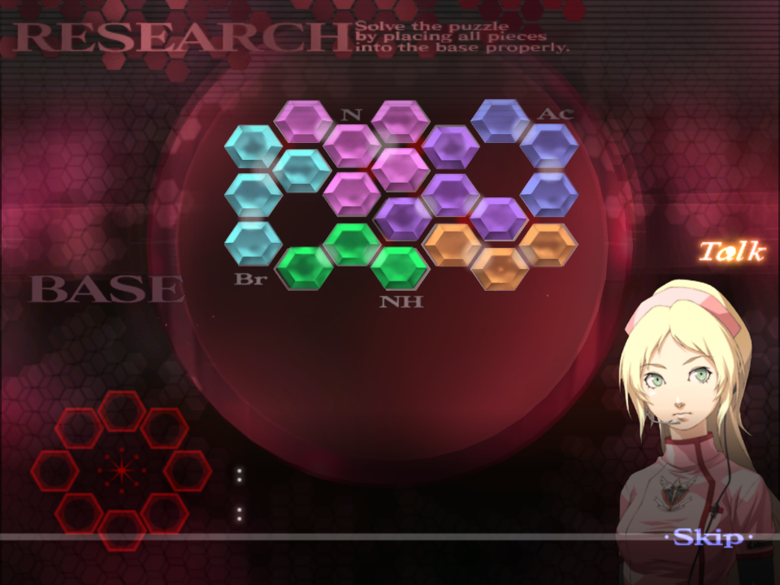

# Chapitre 4

[Retour à la page principale](../../index/fr/index.md)

## 4-2*

La chose principale à se rappeler ici est de ne surtout pas utiliser l'ESS à aucune des opérations. Si vous le faites pour les deux premières, vous allez perdre votre progression. Chaque patient dure environ une minute.  
Les endroits pour cette opération sont fixes et doivent être effectués dans cet ordre :  
  
Les deux premières opérations seront assez semblable, seulement la troisième est légèrement différente.  
Chaque injection requiert un quart de flacon ce qui est très peu.  
La manière idéale pour avoir chaque échantillon aussi rapidement que possible est d'abord d'injecter après avoir ouvert le patient, ensuite attendre qu'il plonge se cacher. Utiliser l'ultrason et le couper aussi rapidement que possible, puis prendre et injecter le the sérum. Pendant que vous attendez qu'il replonge, appliquez du gel sur la coupure.  
Si vous vous sentez audacieux et extrêmement rapide avec votre changement d'outil, vous pouvez gagner un peu de temps en plaçant l'échantillon sur le plateau, prenant le scalpel, couper, puis drainer avant que vous ne soyez interrompu. C'est vraiment très serré comme timing, et vous devriez réalistiquement juste drainer un peu d'échantillon avant qu'il intervienne.  
Sur le dernier échantillon que vous prélevez, ils vont devenir dingues en relâchant du gaz toxique. Vous pouvez juste attendre ça. Pour être complètement optimisé, vous pouvez essayer le gel pour qu'ils ralentissent proches du plateau, cependant cela peut causer du lag.  

## 4-4

Pendant le dialogue de pré-opération, vous pouvez prendre le temps de vous étirer.  

***Merci de suivre les conseils concernant Tetarti qui peuvent être trouvés ici [TAC - Tetarti](../../guilt/fr/tetarti.md) pour cette opération. Ce qui suit sont des conseils uniquement liés à cette opération.***  

Les diverticulites se situent toujours au même endroit, et de la même couleur à chaque fois.  
Vous devez injecter du sérum dans les trois avant de les inciser et les extraire puisque cela réduit la quantité totale de sérum que vous devez utiliser. Commencez par le jaune car c'est celui qui grossit le plus rapidement, puis le vert, et finalement le violet.  
  
Comme pour les tumeurs, vous devez tapoter le gel antibiotique sur chacune des membranes.  
Une fois ceci fait, vous pouvez injecter une seringue remplie de stabilisateur, Angie vous interrompra dans tous les cas.  

## 4-6*

Vous devrez suivre chaque instruction de Victor dans un ordre précis : Scalpel, Laser, Gel, Seringue.  
Pendant la phase des injections, vous aurez besoin d'une seringue de chaque type. Pour la première étape, l'ordre d'injection va de droite à gauche.  
Si vous le faites de la bonne manière, vous pouvez réussir trois injections à chaque étape avant que le noyau bouge. Si vous voulez faire une troisième injection, assurez-vous d'avoir le temps pour éviter d'avoir un raté à cause du fait que le noyau se déplace.  
Pour la deuxième étape, si les signes vitaux sont trop bas, vous devrez les remonter jusqu'à 75.  
L'ordre est : Bleu, puis Jaune. Violet, et enfin Blanc.  
C'est possible de faire une injection juste avant que le noyau ne se déplace, c'est cependant prendre le rique que que Victor vous hurle dessus et de devoir recommencer l'injection.  
Après la deuxième injection de sérum blanc, sélectionnez le scalpel et commencez à couper dans la zone de dessous puisque le noyau apparaitra toujours ici :  
  
Soyez prêts à déposer le noyau sur le plateau après l'avoir découpé.  

## 4-7*

Le puzzle a une solution définie que vous pouvez retrouver ci-dessous.  
Je vous recommande de le faire de la même manière à chaque fois pour vous habituer, pour que vous puissiez le refaire sans la solution.  
  

## 4-8*

Vous allez avoir besoin d'injecter les nanomachines trois fois avant que le noyau soit exposé. Chaque injection doit être une dose complète.  
Comme dans l'opération de recherche scientifique 4-6, vous pouvez effectuer trois injections d'une traite si vous êtes assez rapide. 
Vous n'avez pas besoin d'utiliser le laser sur les petites tumeurs mais le faire peut empêcher les signes vitaux de trop baisser.  
Dans la seconde phase d'injection, faites attention puisque le noyau peut bouger après votre première injection.  
Après la dernière injection, commencez à couper start la zone du dessous pour découper le noyau car il apparaitra toujours ici.  

## 4-9

Les solutions des puzzles sont toujours les mêmes, voir ci-dessous.  
  
Je vous recommande encore une fois de les faire de la même manière à chaque fois pour vous habituer, pour que vous puissiez les refaire sans la solution.  
  

## 4-10

Contrairement aux opérations de recherche scientifique, il suffit de deux injections de nanomachines pour exposer le noyau.  

***Merci de suivre les conseils concernant Pempti qui peuvent être trouvés ici [TAC - Pempti](../../guilt/fr/pempti.md) pour cette opération. Ce qui suit sont des conseils uniquement liés à cette opération.***  

Même si vous jouez de manière optimale, c'est vraiment *très* compliqué de réussir à détruire tous les petits noyaux bleus lors de la vague initiale, essayez de détruire les quatres premiers noyaux en partant de la gauche, laissant celui le plus à droite. Ceci est dû à Victor et Angie qui parlent.  
  
A la fin de cette opération, méfiez-vous de Victor qui parle ce qui implique que vous devez attendre une demi-seconde supplémentaire avant de pouvoir faire votre suture.  

---

← [Chapitre 3](./chp3.md) | [Page principale](../../index/fr/index.md) | [Chapitre 5](./chp5.md) →