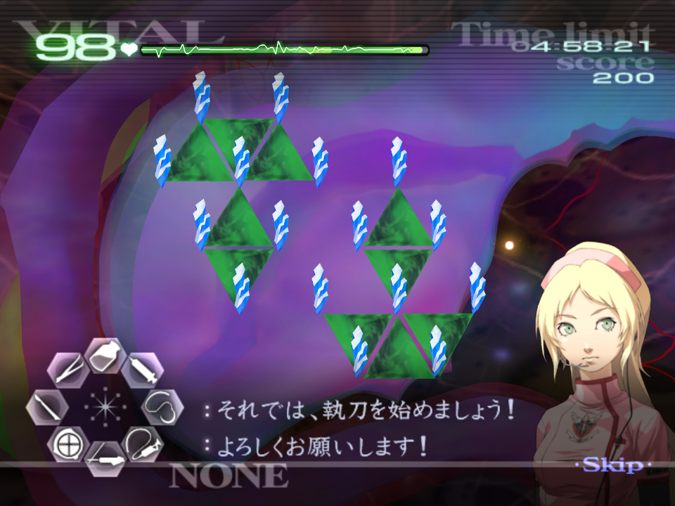
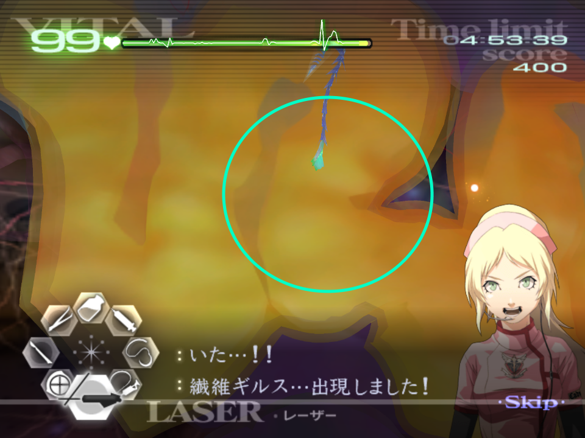
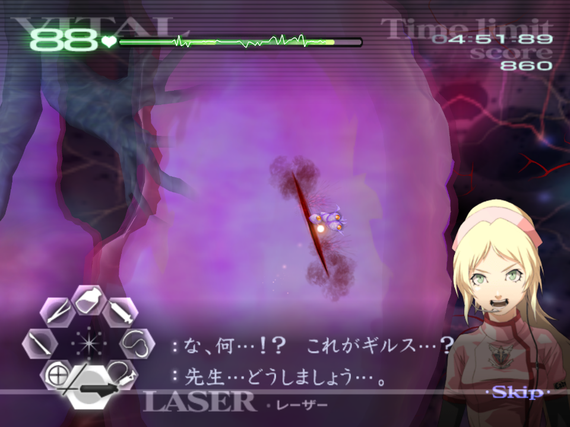
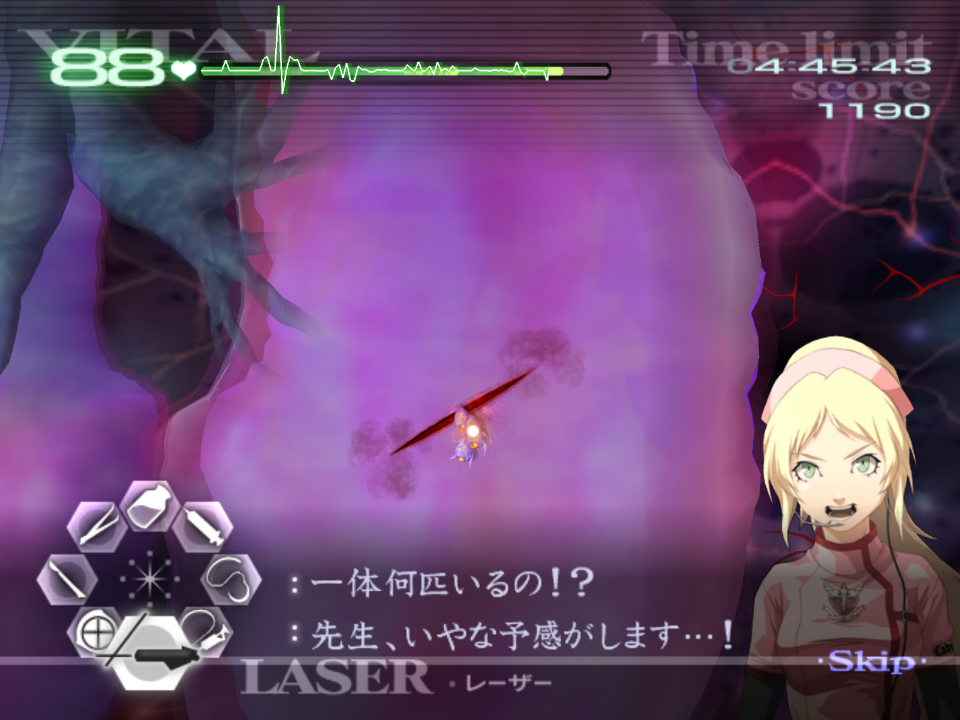
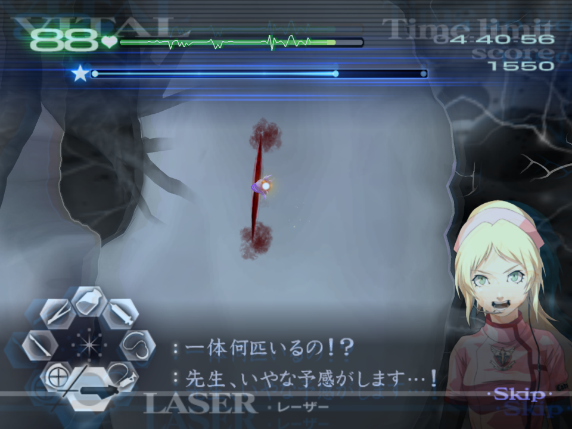
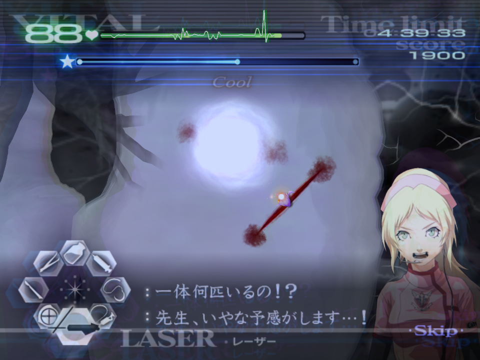
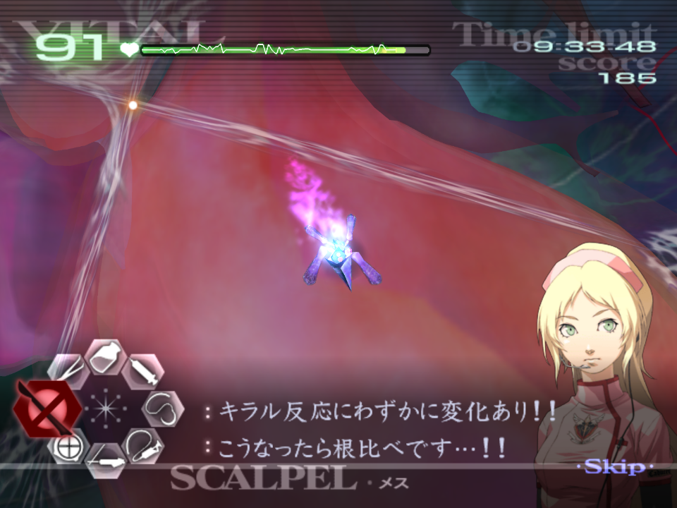

# Chapitre 5

[Retour à la page principale](../../index/fr/index.md)

## 5-2*

***Merci de suivre les conseils concernant Kyriaki qui peuvent être trouvés ici [TAC - Kyriaki](../../guilt/fr/kyriaki.md) pour cette opération. Ce qui suit sont des conseils uniquement liés à cette opération.***  

Du fait que cette opération soit composé de cinq patients qui ont le Kyriaki qui s'enchaînent, ça va sérieusement mettre à l'épreuve vos capacités en termes de changement d'outil, rythme, gestion des signes vitaux, et votre vitesse d'exécution générale.  
Si vous avez un rythme correct, vous n'avez besoin que de remonter les signes vitaux des patients deux et cinq.  
Chaque patient augmente en difficulté (approximativement). Le premier patient commence avec un immature, suivi de deux autres dans la prochaine vague, et finalement le mature penddant la vague finale. Le second patient commence avec deux immatures à la première vague, suivi de trois dans la suivante, et finalement du Kyriaki mature. Le troisème patient commence avec deux immatures, puis encore deux la prochaine vague, et le mature sera accompagné d'un immature dans la dernière vague. Le quatrième patient sera exactement le même. Enfin, le cinquième patient commencera avec trois immatures, puis encore deux, et un immature en plus avec le mature.  
Ne vous embêtez pas à remonter les signes vitaux entre chaque patient car ils sont réinitialisés au max (99).  
Si vous tuez un patient, vous devrez refaire l'entièreté de l'opération, il est donc préférable d'être légèrement plus lent mais d'assurer le coup plutôt que de foncer et de tuer le patient.  

## 5-3*

***Merci de suivre les conseils concernant Triti qui peuvent être trouvés ici [TAC - Triti](../../guilt/fr/triti.md) pour cette opération. Ce qui suit sont des conseils uniquement liés à cette opération.***  

Le paterne pour Triti est toujours le même, et je recommande d'utiliser la main curatrice lors de cette opération.  
Malgré être divisé dans deux zones différentes, vous devez extraire toutes les épines et membranes d'une traite, en ne touchant pas aux membranes avant que toutes les épines soient enlevées.  

## 5-4

***Merci de suivre les conseils concernant Tetarti qui peuvent être trouvés ici [TAC - Tetarti](../../guilt/fr/tetarti.md) pour cette opération. Ce qui suit sont des conseils uniquement liés à cette opération.***  

Les diverticules sont toujours placés aux mêmes emplacements à chaque fois.  
Vous devez traiter le jaune en premier, ensuite le vert, puis le violet, car c'est dans le même ordre qu'ils grossissent.  
  
Tout comme dans l'opération 4-4, vous devez faire l'injection dans les trois avant de les exciser.  
Vous tapotez ensuite le gel sur les membranes.  
There is enough time while you wait to boost the vitals while you wait for the Tetarti to appear.  
Despite Angie's comments about it being mutated, the only difference is you will need to complete more waves overall.  

## 5-6

***Merci de suivre les conseils concernant Paraskevi qui peuvent être trouvés ici [TAC - Paraskevi](../../guilt/fr/paraskevi.md) pour cette opération. Ce qui suit sont des conseils uniquement liés à cette opération.***  

Après avoir traité les deux petites plaies, il y a assez de temps pour remonter les signes vitaux du patient au maximum.  
Paraskevi va apparaître proche de cette zone au centre, avec la queue proche de la courbure de l'intestin :  
  
Victor et Angie vont brièvement vous interrompre après avoir paralysé Paraskevi pour la première fois, soyez prêt à ça et ne tentez pas de couper en deux Paraskevi pendant qu'ils parlent.  

## 5-8

Chaque plaie de laquelle les Savato immatures vont appraître sont prédéterminées. Il y en a 8 au total.  
L'apparition d'un Savato bleu plus grand (le "blue boi") cela requiet 5 immatures, si cela se produit, les signes vitaux du patient seront divisés en deux.  
Pour chaqu'une des coupures, les immatures sortent du centre, ce qui les rend faciles à viser.  
Pour la première vague après avoir suturé les lacérations, soyez prêt à utiliser votre laser ici :  
  
À partir de là, soyez prêt à utiliser le laser pour la prochaine lacération juste là :  
  
Ensuite pour la troisième coupure c'est juste ici :  
  
Après cette lacération, attendez approximativement trois secondes et activez la main curatrice, juste avant que la prochaine coupure n'apparaisse :  
  
Les deux suivantes sont situées l'une à côté de l'autre :  
  
  
Les deux dernières plaies arrivent très rapidement. Pour être le plus optimal possible, sur la dernière coupure, vous devez détruire la plupart des immatures mais pas tous. Suturez la plaie, puis finissez avec le laser. Ceci évite un petit peu de texte. Mais c'est un gain de temps vraiment mineur.  
  
  

## 5-9*

***Merci de suivre les conseils concernant Savato qui peuvent être trouvés ici [TAC - Savato](../../guilt/fr/savato.md) pour cette opération. Ce qui suit sont des conseils uniquement liés à cette opération.***  

La première rencontre avec Savato est la plus docile et la moins agressive des variantes.  
Il est possible d'avoir un web-skip plus rapide dans cette opération et d'éviter le dernier brain lors de la dernière étape de la toile. Pour ce faire, vous avez besoin de faire le scapel glitch sur le brain en haut à gauche qui a un croisement. Faites le 10 fois, puis coupez un des autres points de supperposition sur la toile. Répétez le glitch de la même manière 10 fois encore, avant de couper l'intersection de brains en bas à droite. Il devrait vous rester les deux brins finaux avec peu de vie, ce qui veut dire que si vous continuez d'utiliser le scalpel glitch, l'intersection cassera.  
Faire cette technique est très tendue, et ne peut être effectuée *que* sur cette opération et *pas* sur Savato 2.  
  
Pour un gain de temps plus facile, après la dernière injection pour Savato, avant de dessiner l'étoile, prenez une dose complète de sérum, puis dessinez l'étoile. Savato ne devrait pas faire plus de lacérations pendant le temps que ça vous prend.  

---

← [Chapitre 4](./chp4.md) | [Page principale](../../index/fr/index.md) | [Chapitre Z](./chpZ.md) →