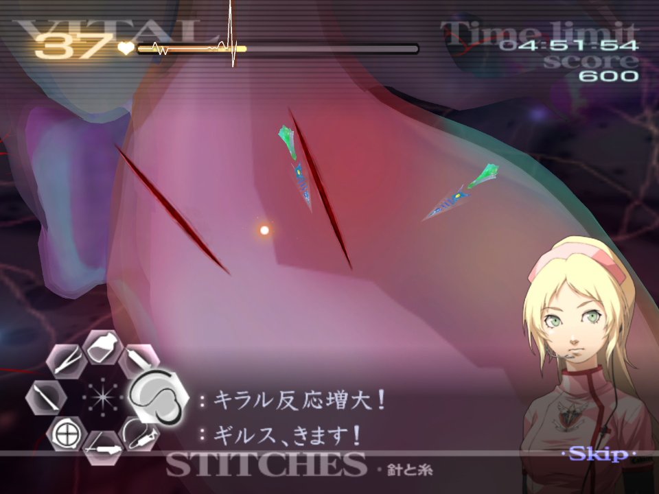
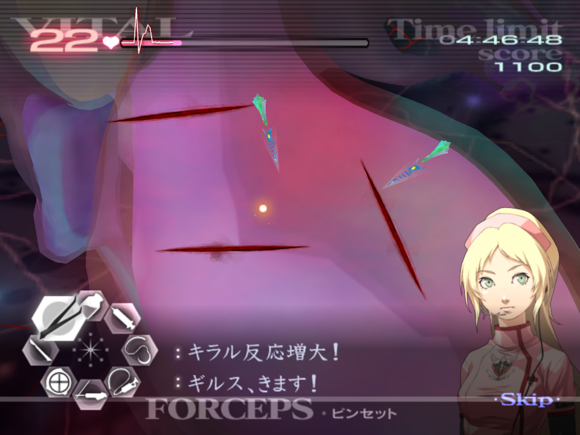
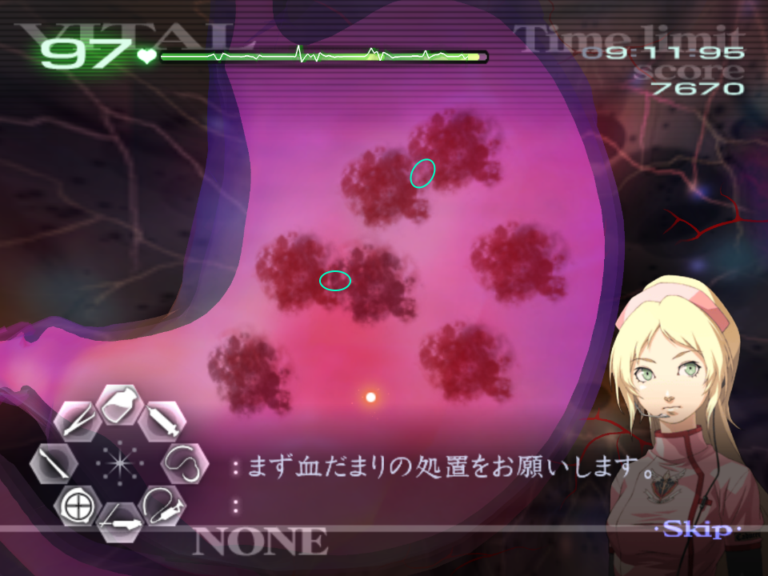

# Chapitre 6

[Retour à la page principale](../../index/fr/index.md)

## 6-3

***Please follow the Tetarti Advice found under [TAC - Tetarti](../../guilt/fr/tetarti.md) for this operation. The below is operation specific advice.***  

In this op there is no diverticula, so draw the serum premptively.  
When Derek grunts (or in JP he hums?), it means you're half way through the operation.  
The gas let off the Tetarti can do quite a bit of damage, so boost the vitals between each wave. Be careful not to over-use the syringe however.  

## 6-4

***Please follow the Kyriaki and Paraskevi Advice found under [TAC - Kyriaki](../../guilt/fr/kyriaki.md), and [TAC - Paraskevi](../../guilt/fr/paraskevi.md) for this operation. The below is operation specific advice.***  

After you suture all the initial cuts, the next set of cuts appear on the left side of the heart:  
  
Once you suture the first two cuts, extract the Paraskevi segments.  
The next three cuts also appear on the left and middle of the heart:  
  
After extracting all of the Paraskevi, pop Naomi's Healing Touch, and begin dealing with the five immature Kyriaki. It's recommended you expose all five before treating.  
Note that each immature takes **three hits** to kill.  
Upon dealing with the immatures, and suturing the cuts, there is a brief period of downtime to wait.  
Once the final wave starts with the mature Kyriaki, deal with the Paraskevi first as it is a bigger threat.  
With the Paraskevi extracted, deal with the Kyriaki as normal.  

## 6-6*

***Please follow the Pempti Advice found under [TAC - Pempti](../../guilt/fr/pempti.md) for this operation. The below is operation specific advice.***  

Although Angie claims that Pempti is mutated here, it is no different from usual, with the exception that the cycles are marginally faster.  
It is possible to kill all the blue/polyp cores before they complete their animation, by lasering two cores at once.  

## 6-7*

This operation is ***four*** GUILT patients back to back.  
***Please follow the Triti, Kyriaki, Deftera, and Paraskevi Advice found under [TAC - Triti](../../guilt/fr/triti.md), [Kyriaki](../../guilt/fr/kyriaki.md), [Deftera](../../guilt/fr/deftera.md), and [Paraskevi](../../guilt/fr/paraskevi.md) for this operation. The below is operation specific advice.***  

The Doctor you play as, and their respective Healing Touch alternates, starting with Derek.  
As such, you will have access to Derek's Healing Touch for Triti or Deftera and; Naomi's Healing Touch for Kyriaki or Paraskevi.  
Like in the rest of the game, you can only use each doctor's HT for a single patient.  
Use of the Healing Touch depends on your confidence with the varying types of GUILT. Generally it is recommended to pop Derek's HT for Triti, and if needed Naomi's HT for Paraskevi.  

For Triti, the pattern is always the same. Pop HT and extract all the thorns, followed by the triangles.  

For Kyriaki, you shouldn't need to boost the vitals if you are quite efficient.  
After dealing with the first few immatures, the next wave will start immediately, rather than after the sutures.  
Note that the mature will be accompanied by an immature as well.  

For Deftera, it is best to aim to drain multiple pools of blood at once:  
  
Blood will occasionally spawn, but it should be the last thing you deal with unless it is in the way of you draining or lasering a tumour.  

For Paraskevi, if you have concerns, you can utilise Naomi's HT to boost the vitals back to max; it's best to do this after you have dealt with half of it.  
Given you are working on the heart, you cannot allow Paraskevi to burrow. Luckily, Angie shouts at you if a segment is preparing to burrow.  

## 6-8*

***Please follow the Savato Advice found under [TAC - Savato](../../guilt/fr/savato.md) for this operation. The below is operation specific advice.***  

The web phase is RNG, and you might get 4 or 5 web in the secondary stage.  
It isn't possible to get a web-skip on the final stage, so cut each overlap. As you cut the final overlap, an extra strand will spawn. While you wait for the scalpel, be sure to laser all the immatures.  
As Savato 2 is generally more aggressive, be mindful of the vitals given they can drop.  
In the second shield phase, if you need to, you can use Naomi's HT without worrying you can't finish the operation, as you are playing as both Derek and Naomi.  
On the first and second shield phases, you don't need to focus on the immatures too much, lest they are getting out of hand and likely to spawn a larger blue savato which will half the vitals.  

---

← [Chapitre Z](./chpZ.md) | [Page principale](../../index/fr/index.md)