# Chapitre Z

[Retour à la page principale](../../index/fr/index.md)

## Z-1

Pour moins de movement de curseur et un changement d'outil optimisé, vous devez drainer le sang à droite, puis en haut avant de drainer la coupure à droite, et appliquer du gel dans la foulée. Ceci vous fait éviter de bouger votre curseur.  
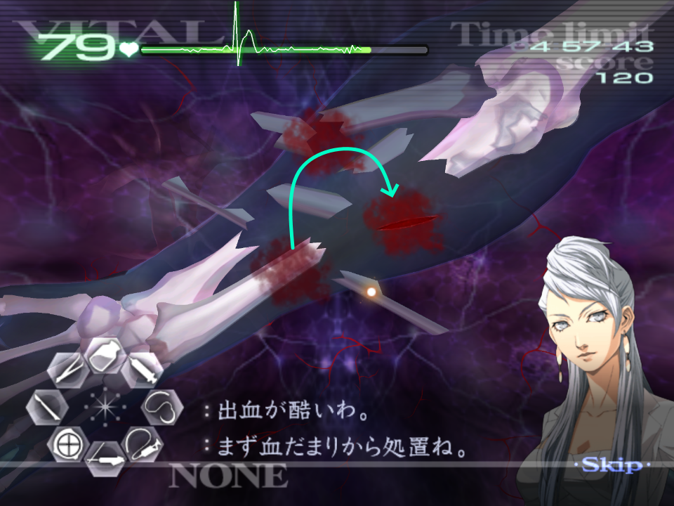  
L'ordre dans lequel vous prenez les fragments d'os est le même que celui lorsque vous allez les replacer. Pour cette raison, vous devez toujors prendre les fragments dans le même ordre pour la régularité - vous devez à terme atteindre un point où vous n'avez plus besoin de regarder le fragment pour savoir où il doit aller. Comme par exemple :  
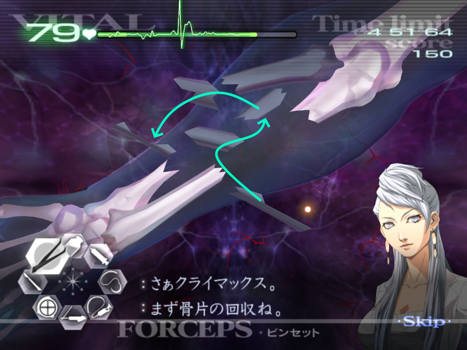  
Essayer de réaligner le coude peut être compliqué, ci-dessous, vous pouvez retrouver un point qui devrait vous guider.  
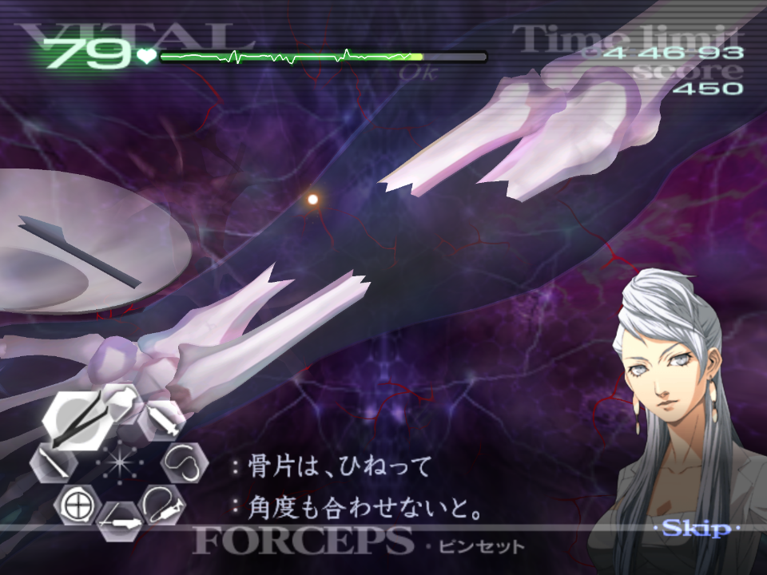  
Les rotations des fragments d'os est un peu bizarre, et lâcher A ou B peut également bousculer votre main. La manière la plus confortable de le faire est de préventivement tourner votre main dans la direction opposée, prendre le fragment, puis faire revenir votre main dans sa position initiale, et le lâcher.  
Le fragment final d'os se trouvera toujours ici et vous pouvez simplement l'inciser sans utiliser l'ultrason au préalable.  
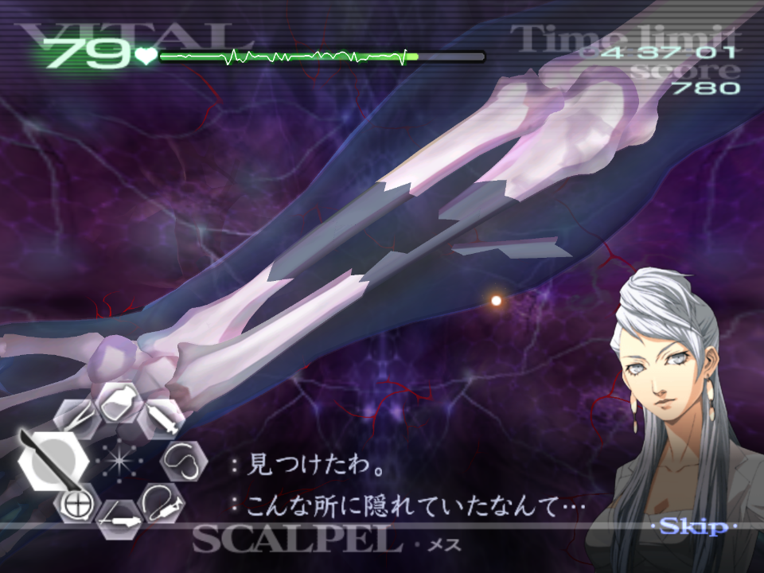  
Ce fragment peut aussi être lâché sans avoir besoin de tourner votre poignet du moment qu'il est lâché au milieu de l'espace où il doit être.  
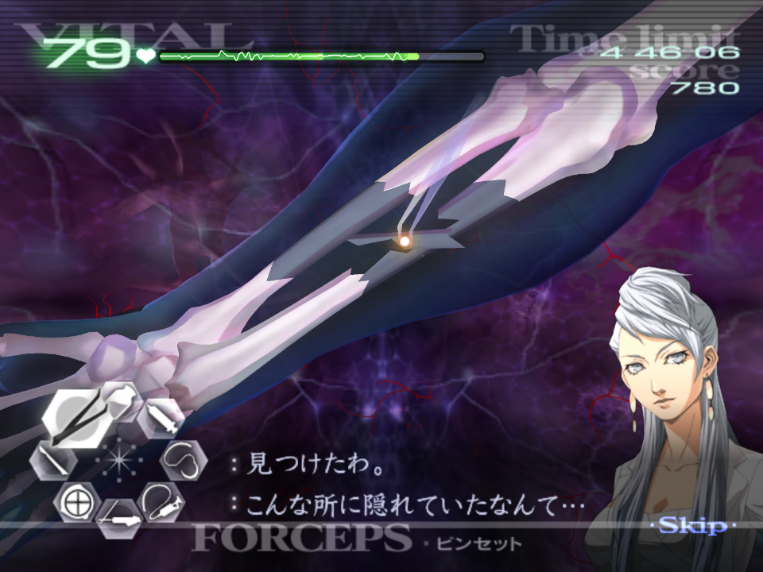  

## Z-2

Ça peut être intéressant de garder en tête que vous n'avez pas à vous préoccuper de la régénération des tumeurs car le temps est juste en Normale pour le faire.  
Si vous êtes inquiets à propos des signes vitaux qui baissent trop rapidement, vous devez couper deux veines pas tumeur, puis couper la dernière veine collectivement et extraire les tumeurs.  
Les tumeurs apparaissent toujours au même endroit, voici leurs rotations.  
Traitez les tumeurs en premier, suivi des polypes/petites tumeurs.  
La hitbox des veines ne commence qu'à partir d'un tier de la tumeur, donc faites attention de ne pas inciser trop proche :  
  
Du moment que les signes vitaux ne sont pas trop bas après la paire de tumeurs dans la seconde vague, vous devriez être ok.  
Après que Naomi active sa main curatrice, vous pouvez drainer une des tumeurs avant qu'elle ne vous interrompe :  
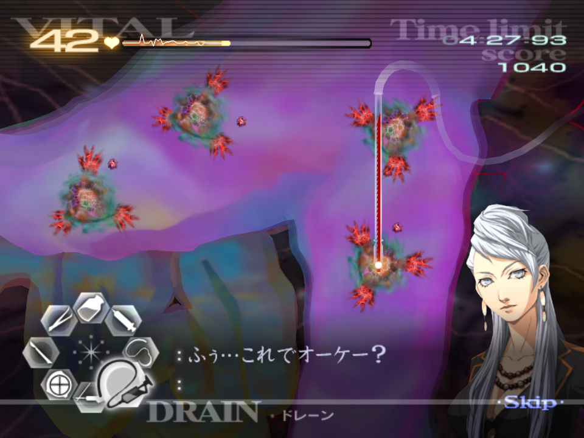  
Gardez en tête que le sang va vous empêcher d'appliquer du gel lorsque vous traitez les petites tumeurs.  
Vous devez utiliser le laser sur des clusters, (càd: par tumeur) et appliquez du gel pour empêcher davantage de saignement.  
Avec la main curatrice active, vous devriez être capable de couper chaque veine par tumeur, puis de les extraire en ayant une marge de manoeuvre assez correcte.  
Si vous êtes inquiets que les signes vitaux chutent trop ou si vous êtes plus lent, vous pouvez laisser une tumeur, couper deux veines par tumeur, ensuite la dernière veine de toutes les tumeurs en même temps, et extraire.  

## Z-3*

Au début de l'opération, vous devrez d'abord révéler les trois lacérations en haut à droite de la poitrine pour que vous ayez accès aux sutures.  
Après la première lacération, Naomi va parler un petit peu et vous pourrez accéder au reste des outils.  
Toutes les zones sont stationnaires et sont les mêmes à chaque fois il est donc possible de traiter chaque zone sans bouger le stylo qui vous sert de lumière. C'est idéal pour éviter de perdre du temps pendant que vous déplacez la source de lumière.  
  
Si vous laissez la lumière dans la seconde zone (celle à gauche dans l'image de dessus), vous ne verez que les bords des plaies, mais vous pourrez tout de même les traiter même si la lumière n'est pas directement sur la zone concernée.  
Vous pouvez utiliser la main curatrice de Naomi si vous êtes inquiet à propos des signes vitaux du patient, mais vous devriez être tranquille et ne pas en avoir besoin si vous êtes raisonnablement rapide.  
  
Dans la zone finale, si vous êtes assez rapide, vous pouvez espérer suturer les trois lacérations de gauche avant que la lumière ne s'éteigne.  
Ce n'est pas nécessaire d'utiliser le flash de la caméra si vous pouvez mémoriser la localisation de la grosse plaie, le bout de verre, et la lacération à droite.  
Ici, utiliser la caméra est considérablement plus lent, donc essayez de retenir ces emplacements.  
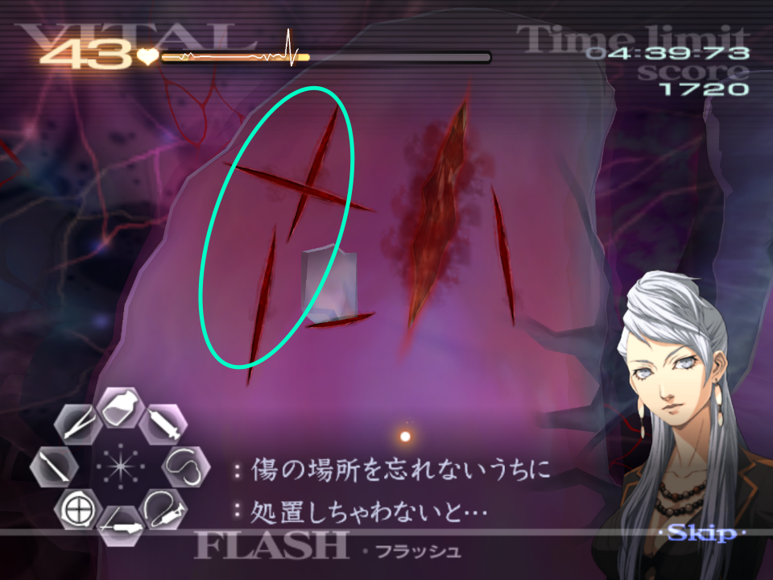  

## Z-4

Du fait que les signes vitaux soient déjà assez bas, et si vous vous souciez de potentiellement lâcher une des tumeurs, activez la main curatrice de Naomi avant de couper les dernières veines et faites l'extraction. Pour une approche plus rapide cependant, retirer les deux tumeurs puis activez la main curatrice. 
Ces grosses tumeurs sont toujours localisées au même endroit.  
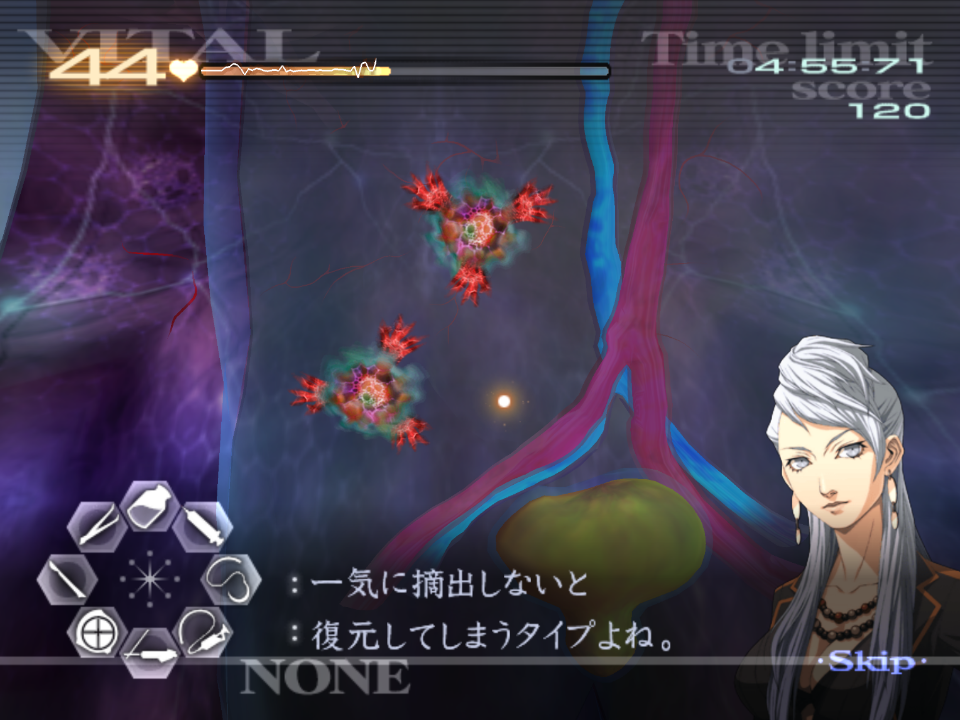  
Après l'extraction, si vous n'avez pas activé la main curatrice de Naomi faites-le.  
Vous devez mettre du sédatif dans l'artère (rouge) et la veine (bleu) avec une seringue et deux-tiers d'injections pour chacune.  
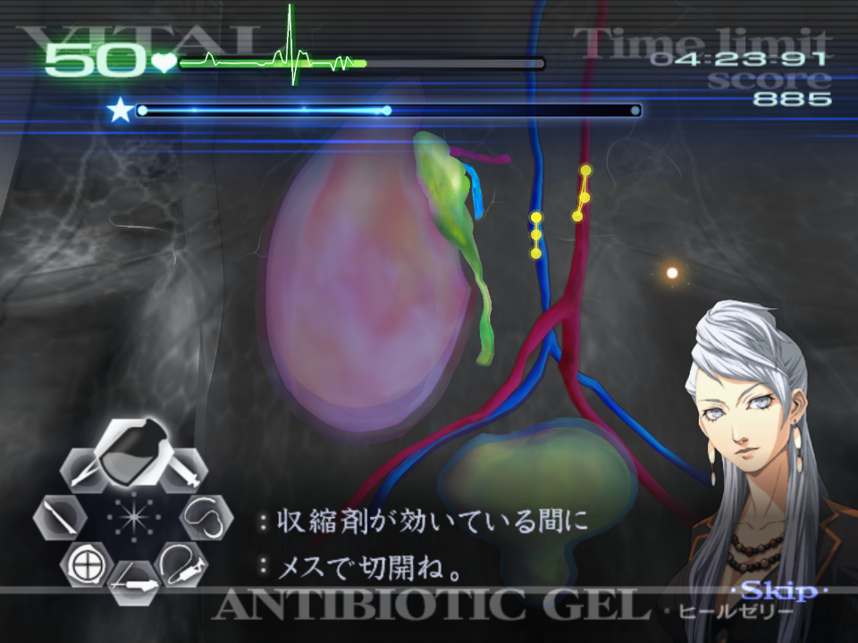  
Après ceci, vous devez couper les deux lignes de points, puis connecter les deux parties. Vous devez d'abord connecter l'artère puis suturer. L'artère va prendre la priorité si vous connectez les deux, car elle est "au-dessus" de l'autre.  
  
Quand vous suturez la vessie, essayez de le faire de manière verticale (des zigzags haut et bas).  
L'attente que vous avez ici pour la fin du sédatif n'est pas régulier et va dépendre de combien de temps vous prenez. Attendez-vous à attendre entre 5 et 10 secondes.  

## Z-5

***Merci de suivre les conseils concernant Kyriaki qui peuvent être trouvés ici [TAC - Kyriaki](../../guilt/fr/kyriaki.md) pour cette opération. Ce qui suit sont des conseils uniquement liés à cette opération.***  

Pour commencer, traitez les lacérations et le triple Kyriaki qui suit. Notez qu'il y a besoin de trois dégâts au laser pour tuer un immature.  
Suturez la plaie d'où sort le Savato bleu, puis activez la main curatrice de Naomi.  
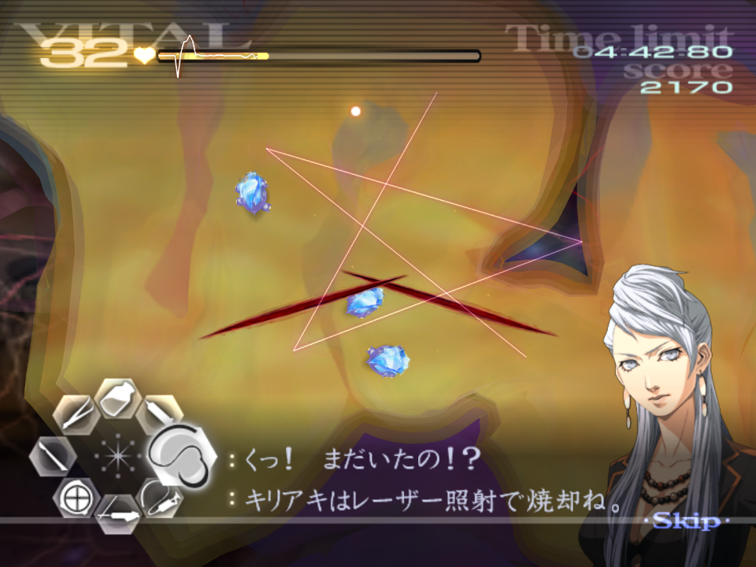  
Continuez de traiter Kyriaki jusqu'à ce que ça soit fini en ignorant les Savato bleu. Toucher Savato avec un laser vous fera être interrompu par le "petit monsieur".  
Vous n'avez besoin d'extraire qu'**un** Savato bleu, donc faites une seule l'injection, placez-le Savato Bleu sur le plateau et tuez les deux autres.  
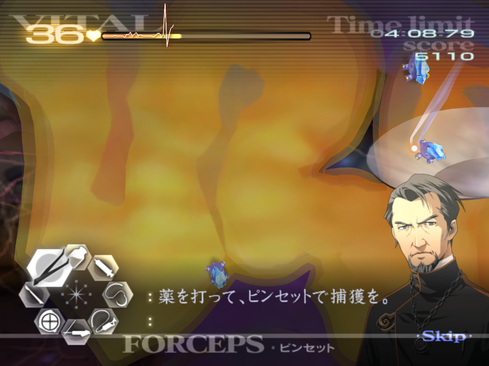  
Quand vous essayerez d'injecter le sérum au Savato Bleu, vous aurez besoin d'environ 3/4 de seringue pour appliquer le sédatif, il doit en revanche être appliqué en une dose. Vous devez en viser un qui est immobile, pour éviter d'avoir un raté.  
Si vous tentez de le faire sur un Savato Bleu qui bouge, prenez le plus d'avance possible pour vous permettre de l'injecter entièrement pendant son mouvement.  

---

← [Chapitre 5](./chp5.md) | [Page principale](../../index/fr/index.md) | [Chapitre 6](./chp6.md) →