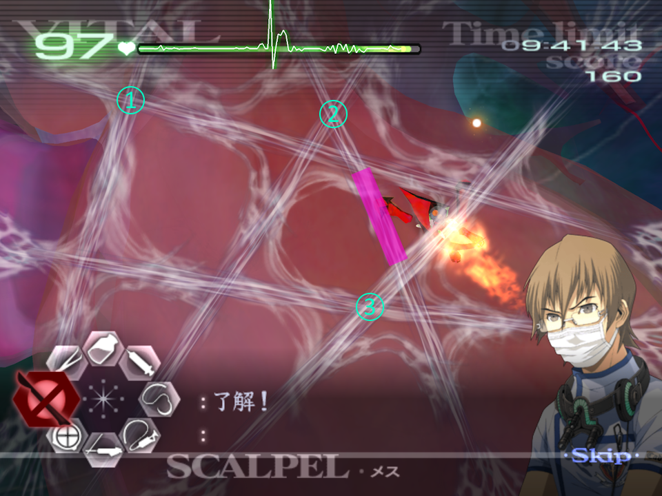

# TAC - Savato [Rencontre avec la Mort]

[Retour à la page principale](../../index/fr/index.md)

***Ces conseils s'appliquent à toutes les opérations qui impliquent Savato.***  

Agissant comme boss final du jeu, Savato est un test de précision, de management des outils, et d'adaptabilité. Mais vous allez être enchanté de lire que nous avons plusieurs techniques pour faire en sorte que cette souche soit plus facile. Mais ça ne l'empêche pas de faire perdre des secondes due à son agressivité et son comportement RNG (aléatoire).  

## Phase de la toile & Glitch du scalpel

Après avoir ouvert le patient, vous devrez tout d'abord couper la toile. La méthode la plus efficace pour se faire est de se placer à l'intersection de deux segments.  
Faire cette technique fait que le brin qui n'a pas été coupé parmi les deux se retrouve à un point de vie.  
Couper à chaque intersection fait que vous êtes efficace: en faisant moins de coupe pour le même nombre de scalpel utilisés.  
Pour utiliser le glitch du scalpel, selectionnez le scalpel avec votre curseur sur un brin, maintenez A. Puis, pressez C ou Z comme si vous alliez faire la main curatrice. Pendant une frame, le scalpel va avoir la capacité de couper malgré qu'il soit inutilisable. ***Ne faites cette technique que si le scalpel est inutilisable***.  
Notez que le scalpel, pendant qu'il est affiché comme inutilisable peut en réalité l'être. C'est parce que les outils sont réparés légèrement plutôt que ce que l'interface graphique vous laisse penser, ce qui veut dire que dans l'exemple ci-dessous, j'ai coupé le premier brin normalement, puis j'ai utiliser le glitch avec la main curatrice pour le deuxième.  
  
Il y a un ordre idéal pour la troisième/dernière phase avec la toile. Cet ordre vous laisse avec un brin après que trois intersections de la toile aient été coupées. Le faire de cette manière va aussi laisser un autre brain qui est créé par Savato qui ne va pas déranger les coupures déjà faites. Même dans l'opération 6-7 quand la toile devient rouge, vous avez asser de temps pour brûler au laser les larves avant de couper la toile.  
La zone indiquée en rose est la toile qui va réapparaître, et doit inévitablement être le dernier brin que vous coupez (à moins que vous faites le web-skip noté ci-dessous).  
  

## Web Skip

Avec les connaissances de ci-dessus, dans l'opération 5-9 on peut effectuer un Web Skip à l'étape deux, si on a une mauvaise RNG et qu'on a 5 brins sur la toile. Pour ce faire, vous devez d'abord faire le glitch du scalpel environ 5 fois sur un seul brin pendant que vous attendez que votre scalpel inutilisable le soit à nouveau à cause de la phase précédente. Soyez sûr d'arrêter de faire le glitch avant que votre scalpel soit de nouveau opérationnel ou sinon votre scalpel sera inutilisable encore plus longtemps. Une fois qu'il est opérationnel, coupez une superposition de deux brins comme précédemment en effectuant le scalpel glitch normalement. Ensuite, pendant que vous attendez le retour de votre scalpel, refaites le scalpel glitch 5 fois encore attention sur le **même brin**, vous ne devez pas l'avoir coupé. Arrêtez vous avant que votre scalpel soit rétabli puis refaites le coup de scalpel sur une superposition de deux brins ainsi que le scalpel glitch comme normalement, enfin, 5 coup de scalpel glitch devraient venir à bout du brin restant.  
**Ne faites ceci que dans l'opération 5-9, et quand vous avez une toile de 5 brins.**  

Cette stratégie peut également être étentue à la phase finale lors de l'opération 5-9, cependant au lieu de le faire sur un brin seul vous devez le faire sur la superposition de deux brins. Pour le faire, pendant que vous attendez le retour votre scalpel, exécutez le glitch 5 à 7 fois sur une superposition de deux brins. Ne coupez pas ces brins quand votre scalpel est de retour, au lieu de ça coupez une autre superposition. Répétez encore le glitch 5 à 7 fois sur les mêmes brins avec lesquels vous avez commencé, et coupez les autres superpositions de brins. Il devrait maintenant vous rester les brins sur lesquels vous avez effectué le glitch. Avec quelques coups en plus, ils devraient casser et ceci va passer le dernier brin que Savato est censé faire apparaître, et la phase du bouclier commence.  

Si vous n'utilisez pas le Web Skip, ou si vous combattez Savato dans l'opération 6-8 après avoir traité les deux premières superpositions de brins, quand vous arrivez à la dernière superposition, Savato va créer un nouveau brin ainsi que faire apparaître quelques larves. Pendant que vous attendez que votre laser soit opérationnel, soyez sûr d'utiliser le laser sur toutes les larves avant de couper le dernier brain. En faisant comme ça vous n'avez pas à regarder toutes les larves courir vers Savato ce qui peut prendre un long moment douleureux pour votre temps.  

## Phases de bouclier

C'est la partie où se déroule la plupart du combat contre Savato, et où vous allez jongler entre les signes vitaux du patient, votre laser, et les dégâts de Savato pour choisir votre approche.  
Quelques règles de base pour vous aider à mieux appréhender ce combat :  
1. Savato a des phases de points de vie qui vont progresser à chaque fois que vous aller obtenir un OK en brûlant son bouclier.
2. A chaque fois que Savato attaque, il va revenir à son niveau de vie maximum de la phase en cours, peut importe combien de temps vous l'avez déjà brûlé.
3. Il y a besoin de 5 larves pour créer une plus grosse larve bleue qui va faire grandement faire chuter les signes vitaux.
4. Les lacérations qui font apparaître des larves causent 5 dégâts, et les triples lacérations 10 dégâts.

Si vous êtes en train de brûler Savato au laser et qu'il attaque, vous sentirez les vibrations de votre manette s'arrêter (si elles ne sont pas activées, faites le). Savato va également faire un "piétinnement" avec une toile qui apparaît en dessous, ce qui peut être utile pour repérer quand il va faire une lacération et que des laves sortent. Savato ne fait pas d'animation quand il s'apprête à faire une triple lacération, donc sentez les vibrations s'arrêter pour l'anticiper ou constatez l'apparition des lacérations. Notez que Savato *"saute"* quand il effectue ces lacérations.  
  

## Stade des points de vie de Savato

Comme mentionné plus tôt, Savato a quatre stades de points de vie différents qu'il parcourt séquentiellement à chaque zone du coeur. Chaque stade de vie requiert une certaine valeur de brûlure au laser pour passer à l'étape suivante.  

**5-9**:	49% → 37% → 25% → 11%  
**6-8**:	59% → 47% → 32% → 14%  

Notez que ces pourcentages sont pour la difficulté Normale. En difficile cela requiert généralement légèrement plus de brûlure au laser pour la première et seconde phase du bouclier.  
Quark a fait une [vidéo](https://youtu.be/q4jRUa-p01A) (anglais) qui montre plutôt bien ceci en utilisant le gestionnaire mémoire de Dolpin.  
Une fois que la vie de Savato est descendu d'une étape, il va toujours faire une lacération qui fera apparaître des larves.  

## Durabilité du laser

Étant donné que le laser n'a qu'une durabilité limitée, infliger des dégâts à Savato pendant les attaques peut s'avérer compliqué pour ne pas tomber à court d'utilisation de laser juste avant pouvoir accéder à la prochaine étape de ses points de vie.  
Tout d'abord, l'interface vous indique combien de durabilité il reste à votre laser :  

Blanc:		100-51%  
Jaune: 	50-26%  
Rouge: 		25-1%  

Deuxièmement, le laser prend du temps à être réparé. Cela peut sembler évident, mais il peut être plus rapide de brûler complètement le laser et d'attendre qu'il soit réparé. Il y a une limite exacte pour savoir quand c'est mieux de le faire, qui est 41.632%. Cependant c'est presque impossible de pouvoir dire quand ça arrive, donc la règle générale que je suis c'est : *Si vous avez utilisé le laser jusqu'à le voir en jaune sur l'inferface, utilisez le complètement*.  
Ce n'est pas exact évidemment, mais ça vous donne un ordre d'idée de quand c'est plus bénéfique que d'attendre qu'il se régénère.  
Cependant, il y a des moment où peut importe si vous devez attendre que votre laser se régénère. Notemment si vous devez faire pas mal de nettoyage de lacérations ou si les signes vitaux sont trop bas pour continuer de brûler Savato au laser. C'est à vous de voir quand vous devez le faire, et avec l'expérience vous serez capable de déterminer quand est-ce qu'on préfère traiter les blessures ou attaquer Savato.  

## Larves

Ces petites araignées ne causent pas réellement de problème en soi, cependant c'est important de ne pas en laisse trop se balader sur le coeur pendant que vous vous attaquez au bouclier de Savato. Seulement **cinq** sont nécessaire pour qu'un Savato bleu puisse se former ce qui fait significativement les signes vitaux et réduit le nombre maxium de signes vitaux aussi. Cependant, contrairement à l'opération 5-8, vous avez une période sûr où aucune fusion ne peut avoir lieu.
Quand Savato fait des lacérations avec des larves qui apparaissent, elles vont se former au milieu ce celle-ci. Le meilleur moyen de s'en occuper est de préparer son laser au centre de la lacération afin de toutes les brûler en même temps avant qu'elles n'aillent plus loin.  

## Phase finale

La phase finale de Savato est lorsque vous avez percé son bouclier pour la quatrième fois et que vous devez injecter le sérum noir afin de le neutraliser. Ceci requiert **une dose complète** du sérum, donc si vous manquez, vous pouvez faire une croix sur le très petit temps que vous venez de perdre.
Notez qu'avant que vous injectiez la première dose du sérum les signes vitaux **doivent** être au dessus de 30. S'ils ne le sont pas, les signes vitaux vont atteindre 0 et le patient va mourir. Cependant, il existe une stratégie extrêmement risqué que vous pouvez utiliser si les signes vitaux du patient sous juste en dessous de la barre des 30 - après la première injection, il y a une fenêtre de temps où Savato se place au centre de l'organ et où la main curatrice s'active pendant que les signes vitaux chutent. Vous pouvez injecter du stabilisateur pendant ce temps pour empêcher le patient de mourir. C'est une fenêtre de tir très courte qui requiert une certaine rapidité, et je ne vous recommanderais pas cette pratique à moins que vous sachiez que vous êtes capable de remonter les signes vitaux du patient à temps.

## Main curatrice & Lag

Si vous avez déjà battu Savato avant, vous aurez probablement remarqué que quand vous activez la main curatrice de Derek, il y a une certaine quantité de lag. Ceci est dû au sang qui sort des plaies lorsqu'elles sont créées et du fait que l'opération soit directement sur le coeur.  
Sachant qu'on base nos temps de speedrun sur le temps réel plutôt que le temps du jeu, avoir moins de lag sur Savato peut permettre de gagner un certain temps car l'injection et l'animation finale seront beaucoup plus rapide.  
Pour avoir un Savato "sans lag" vous devez utiliser la main curatrice quand aucune nouvelle lacération n'est en train d'être faite et que le sang des lacérations précédentes s'est dissipé.  
Dessiner une étoile dans cette fenêtre de temps peut cependant se révéler incroyablement difficile, c'est pour quoi à la place vous devez **"buffer"** votre étoile. Pour faire cette manipulation, dessinez votre étoile normalement cependant ne relâchez pas A ou B lors de la ligne finale, au lieu de ça maintenez votre curseur au point final de votre étoile. Vous pouvez théoriquement faire ça à l'infini. Relâchez A ou B pour utiliser la main curatrice une fois que le sang s'est dissipé :  
  
Note sur l'exemple ci-dessus, j'ai pris le sérum avant d'activer la main curatrice de Derek. Cela peut être également fait dans l'opération 5-8 où Savato n'attaque pas pendant une grande période. Dans tout les cas cette période serait sinon de l'attente en attendant d'utiliser la main curatrice avec la technique du buffer, donc prendre le sérum avant ici fait gagner un peu de temps. Malheureusement dans l'opération 6-8 Savato est trop agressif pour faire ça.  

---

← [Paraskevi](paraskevi.md) | [Page principale](../../index/fr/index.md) |