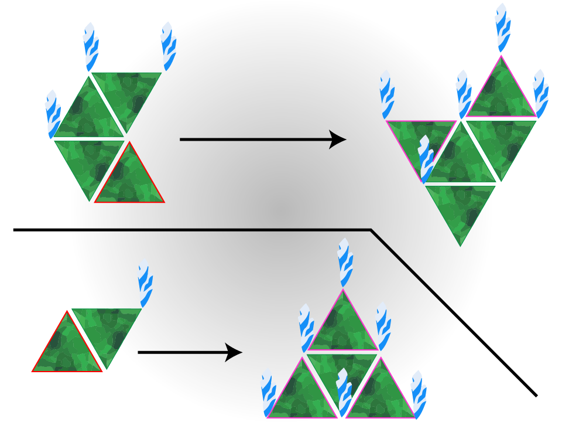

# TAC - Triti [Le cauchemar contagieux]

[Retour à la page principale](../../index/fr/index.md)

***Ces conseils s'appliquent à toutes les opérations qui impliquent Triti.***  

Triti est l'une des souches de TAC les plus triviales en conditions de speedrun, cependant lorsque vous faites le jeu normalement en casual c'est un véritable cauchemar, comme son nom l'indique.  

## Règles d'expension

L'un des facteurs les plus importants pour traiter Triti est de rapidement comprendre comment le contrôler. Malgré que nous utilisons la main curatrice, c'est très important de savoir comment traiter Triti sans l'utiliser au cas où vous en auriez besoin.  
Triti respecte deux règles principales qui s'appliquent dès lorsqu'une membrane est retirée. Notez que les épines de Triti conditionnent là où il peut s'expendre. Donc en retirant toutes les épines Triti ne se propagera pas si une membrane est retirée:  
1. S'il y a une bordure entre deux épines où Triti peut s'expendre et qu'une membrane est retirée, il va s'étendre à cet endroit.
2. Si une épine est laissée toute seule quand une membrane est retirée, cela va créer 3 nouvelles membranes aux bords de la dernière membrane en question.
Notez que Triti, comme les autres souches de TAC est confiné par l'organe. Une technique sûre est donc d'acculer Triti dans un coin si vous n'êtes pas en mesure de l'extraire.  
Ces règles sont vérifiées chaque fois qu'une membrane est retirée, donc si vous extrayez une membrane alors qu'il y a de l'espace pour qu'elle se propage et que vous en enlevez une autre, elle s'étendra plus loin que prévu.  
  

## Triangles bleus

Les triangles (ou segments) bleus ne sont pas un soucis à prendre en compte en speedrun, surtout parce que vous allez extraire Triti avant même qu'il cause assez de dégats pour tuer le patient.  
Dans le cas où vous avez un triangle bleu, ne paniquez pas et continuez simplement l'extraction normalement, les signes vitaux peuvent chuter mais ne considérez pas de les remonter à moins que le patient soit sur le point de mourir. Cela dit, si vous atteignez un point où le patient est sur le point de mourir vous devriez travailler votre précision.  

## Gaz toxiques

Si vous optez pour faire Triti sans la main curatrice, ou si vous jouez en Difficile, vous constaterez des gaz toxiques qui appraîteront lorsque vous retirerez des épines. Cela peut vous ralentir votre enchaînement pour enlever les épines, cependant vous avez une certaine marge de manoeuvree avec ces gaz, ils n'ont pas besoin d'être drainés immédiatement. Cela dit vous ne devez pas attendre trop longtemps, pas plus de 5 secondes.  
Généralement utiliser la main curatrice implique que vous n'avez à gérer aucun gaz toxique pendant l'extraction de Triti car cela nécessite l'extraction de quelques triangles, et que cela dépend aussi de l'opération que vous faites. Dans l'opération 3-10, vous êtes très peu susceptible d'avoir des gaz toxiques, si ce n'est aucun.  

## Extraction

La méthode la plus rapide pour extraire Triti est d'enlever toutes les épines suivies de toutes les membranes. Ceci doit être réalisé sur tout l'organe pas seulement un segment car malgré que les segments semblent séparés, Triti agit comme une seule entité. Cette méthode assure que toutes les membranes soient retirées et que Triti ne peut plus s'expendre car il n'a plus d'épines.  
Utiliser la main curatrice vous donne plus de temps pour le faire, il est hautement conseillé de l'utiliser.  
En prenant en compte que les épines doivent être retirées vers le haut d'environ 5 pixels, les retirer en faisant des mouvement dans le sens des aiguilles d'une montre rend cela plus facile, en levant l'épine vers le haut, et ensuite en faisant un rond jusqu'au plateau, et le répeter. L'image qui suit met légèrement plus en valeur cette méthode que ce que vous devez réellement faire, mais cela vous montre l'idée générale. Cela assure que vous pouvez prendre les épines facilement.  
  
Après avoir enlevé toutes les épines, vous pouvez utiliser enlever les membranes de gauche à droite comme habituellement.  

---

← [Deftera](deftera.md) | [Page principale](../../index/fr/index.md) | [Tetarti](tetarti.md) →