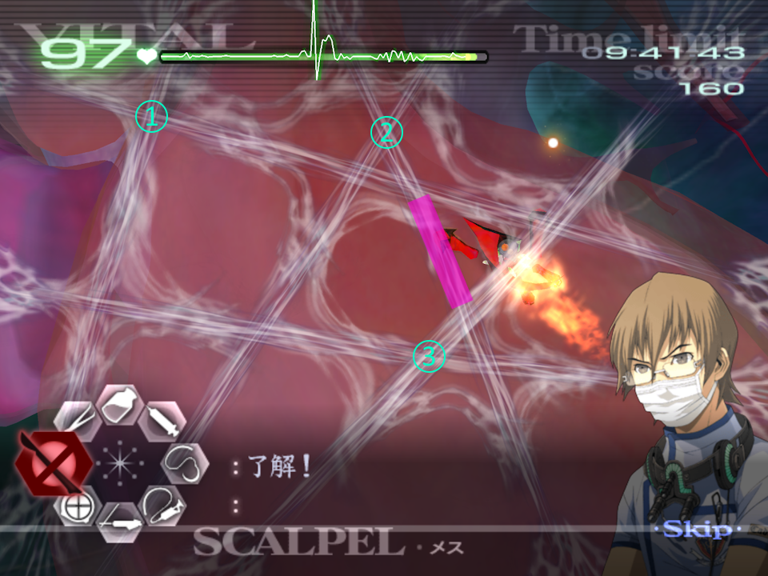

# GUILT - Savato [Face-Off with Death]

[Back to Main Page](../index.md)

***This advice applies to all Operations that involve Savato.***  

Acting as the final boss to the game, Savato is a test of precision, tool management, and adaptability. But you'll be glad to read we have multiple techniques to make this strain as smooth as possible. But that doesn't stop it from sapping seconds away due to it's aggressive behaviour and RNG.  

## Web Phase & Scalpel Glitch

After you've opened the patient, you first need to cut the webs. The optimal method is to cut where two strands overlap.  
Doing this will result in the strand left over being at a single point of health.  
Cutting each overlap means you're effectively doing less cutting for the same amount of scalpel burnout.  
To execute the scalpel glitch, have the scalpel selected and with your cursor over a strand, hold A. Next, tap C or Z as if you were going to initiate Healing Touch. For one frame, the scalpel will cut despite it being unavailable. ***Only do this trick when the scalpel is out of action***.  
Note that the scalpel, while still showing as inactive can be used. This is because tools restore slightly earlier than the UI suggests, meaning in the example below, I cut the first strand normally, and execute the HT glitch for the second strand.  
  
There is an ideal order on the third/final phase of webs. This order leaves you with one strand by itself after the third overlapping web is cut. Doing it this way will also leave extra strand that is made by Savato placed in a way that does not interrupt your existing cuts. Even on 6-7 where the webs turn red, you have enough time to laser the immatures before cutting the webs.  
The area indicated in pink on the web, is the web that will respawn, and will inevitably the final web you cut (unless you perform the web-skip noted below).  
  

## Web Skip

With the above knowledge, on 5-9 you can perform a Web Skip on second web stage, if you have poor RNG and get 5 web strands. To execute this, you first must execute the Scalpel/HT Glitch roughly 5 times on a singular strand while you wait for your scalpel to regenerate after the previous phase. Be sure to stop doing the glitch before your scalpel returns however or your scalpel will be out of action for even longer. Once it has returned, cut two overlapping strands normally, performing the glitch normally. Again, while you wait for your scalpel to return, perform the glitch 5 times again on the singular strand. Stop before your scalpel returns and cut the two overlapping strands once more, then one the final set of 5 the strand should break.  
**Only do this on 5-9, and when you get 5 web strands.**  

This strat can also be extended to the final web phase on 5-9, however instead you must execute the glitch on a set of overlapping strands. To do this, while waiting waiting for your scalpel to regenerate, execute the glitch 5 to 7 times on an overlap. Do not cut this overlap when your scalpel then returns, instead cut a different overlap. Repeat the glitch again 5 to 7 times on the same overlap you had started with, and cut the other overlap. You should now have the last overlap you have been executing the glitch on. With a few more taps, this should break and you skip the extra strand that Savato would normally make, and the Shield Phase begins.  

If you do not go for Web Skip, or dealing with Savato in 6-8, after dealing with the first two overlaps, as you get to the final overlap, Savato will create an extra strand as well as spawn some immatures. While you wait for your scalpel to return, be sure to laser all these immatures before you then cut the final strand. This way you don't have to watch all the immatures run into Savato which can take a painfully long time.  

## Shield Phase

This is where the bulk of Savato's fight takes place, and where you'll now juggle the patient's vitals, your laser, and Savato's own damage to indicate your approach.  
A few ground rules to help you better approach this fight:  
1. Savato has HP stages that upon getting an OK for burning through its shield, it will progress through.
2. Any time Savato attacks, it will regain back to its current HP stage, regardless of how much you had burned through.
3. Five immatures are needed to merge to create a larger immature that cuts vitals down.
4. Cuts that create immatures deal 5 damage, and triple cuts do 10 damage.

If you are lasering Savato, and it attacks, you'll feel the vibration stop on the Wiimote (if you do not have rumble enabled, turn this on). Savato will also do a "stomp" with a web appearing under it that can be helpful to spot when it is going create a laceration and immatures will pour out. Savato does not do an animation when it is about to create a triple cut, so feel for the rumble stopping or the cuts appearing. Note that Savato *jumps* when creating these cuts.  
  

## Savato's Health Stages

As mentioned above, Savato has four HP stages that it goes through sequentially per each area of the heart. Each stage of health requires a set amount of laser to get through.  

**5-9**:	49% → 37% → 25% → 11%  
**6-8**:	59% → 47% → 32% → 14%  

Note that these percentages are for Normal. Hard generally requires slightly more laser for the first and second phase of shield.  
Quark has a [video](https://youtu.be/q4jRUa-p01A) that shows this rather nicely with usage of the Dolphin Memory Engine.  
Once Savato's health has dropped a stage, it will always create a cut that forms immatures.  

## Laser Durability

Given the laser only has so much durability, dealing damage to Savato between attacks is a juggling act as not to run out of laser right before you can move onto the next HP stage.  
Firstly, the UI indicates how much laser you have left:  

White:		100-51%  
Yellow: 	50-26%  
Red: 		25-1%  

Secondly, the laser takes time to restore. This might seem obvious, but it can be faster to burn the laser out and wait for it to recover. There is an exact cut-off for when this is better, which is 41.632%. This however is near impossible to tell, so the rule of thumb I follow is: *If you have use the laser until it shows as yellow on the UI, burn it out*.  
This isn't exact of course, but it gives you a general idea of when this gives more benefit than drawback.  
However, there times where it doesn't matter if you wait for the laser to regenerate. Notably if you have a lot of clean-up or the vitals are too low to proceed with lasering Savato. It is down to you when you should choose to do this, and with experience you'll be able to better determine when you should focus on vitals vs attacking Savato.  

## Immatures

These pesky mini spiders don't cause much of a problem however it is important not to let too many roam on the heart as you tackle Savato's shield. Only **five** are needed before a blue Savato can be formed which drops the vitals significantly and reduces the max vitals as well. However, unlike in 5-8, you have a safety period where no merges can take place.
When Savato creates a cut with immatures spawning, they will form in the centre of the cut. The best way to tackle this is to laser in the centre of the cut before the immatures get further out.  

## Final Stand

Savato's final phase is after you have broken through Savato's shield for the fourth time and you must inject the black serum to neuralise it. This requires a **full dose** of the serum, so if you miss you need to re-draw the very tiny amount you lose.
Note that before you inject the first dose of the serum the vitals **must** be above 30. If they aren't, the vitals will reach 0 and the patient will die. However, there is as very risky strat you can use if the vitals are just below 30 - after the first injection, there is a window where Savato centres itself on the organ and HT activates as the vitals drop. You can inject stabiliser in this window to prevent the patient from dying. This is a very tight window and requires you to be quick, and I wouldn't normally recommend it unless you know you can boost the vitals up in time.

## Healing Touch & Lag

If you've ever defeated Savato before, you will probably notice that when you activate Derek's healing touch, there's an awful lot of lag. This is caused by the blood that comes from the cuts when they are made, and that the op is on the heart.  
Given we time our speedruns in real time rather than game-time, getting a lag-less Savato can save you a fair amount of time as the injection and final animation is considerably faster.  
To get "Lagless Savato" you must activate the Healing Touch when no new cuts are being made and the blood has faded.  
Drawing a star within this window however can be incredibly difficult, and so instead you should **buffer** the star. To do this, draw the star as normal, however do not let go of A or B on the final line, and instead hold your cursor at the end point. You can in theory do this indefinitely. Let go of A or B to then pop the star once the blood has dissipated:  
  
Note in the example above, I have drawn the serum before popping Derek's HT. This can be done in 5-8 where Savato doesn't attack for a longer period. This period you would be waiting anyway if applying the buffered HT technique, so drawing the serum here saves a small amount of time. Unfortunately Savato in 6-8 is too aggressive to do this.  

---

← [Paraskevi](./paraskevi.md) | [Main Page](../index.md) |