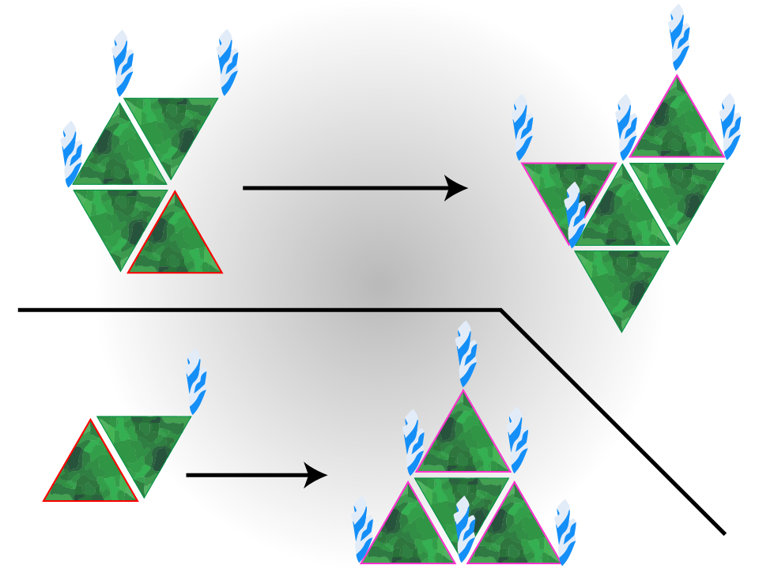
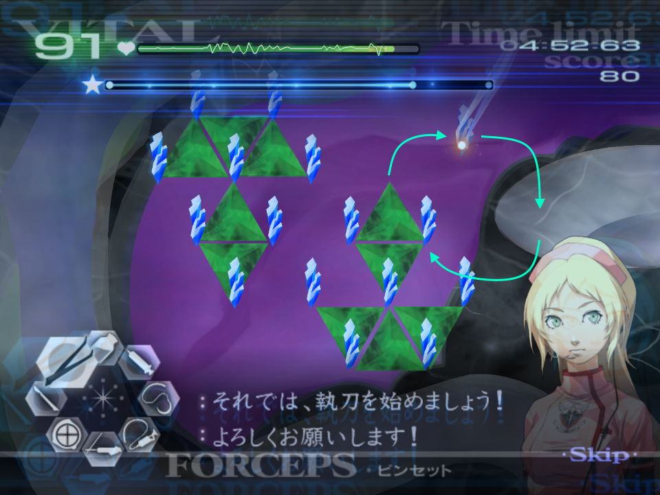

# GUILT - Triti [Contagious Nightmare]

[Back to Main Page](../index.md)

***This advice applies to all Operations that involve Triti.***  

Triti is one of the most trivial GUILT strains in a speedrun setting, however casually it's a nightmare, hence the name.  

## Rules of Expansion

The main driving factor to dealing with Triti quickly is to understand how to control it. Despite the fact we use the Healing Touch, it's incredibly helpful to know how to extract Triti without the healing touch in the event you need to.  
Triti has two rules that it abides by that apply any time you remove a membrane. Note that the thorns themselves are what handle where Triti can expand. So by removing all the thorns, Triti will not spread if a membrane is removed:  
1. If there is an edge where Triti can expand, and a membrane is removed, it will expand into this space.
2. If a singular thorn is left when a membrane is extracted, it will create three membranes on the edges of the final membrane.
Note that Triti, like the other GUILT strains is confined by the organ. A safety strat is to back Triti into a corner if you are unable to extract it all.  
These rules are checked every time a membrane is removed, so if you extract a membrane while there is space for it to expand, and you remove another, it will spread further than expected.  
  

## Blue Segments

The blue segments aren't a huge concern for the speedrun setting, mostly as you will often extract the entirety of Triti before it can cause enough vital damage to kill the patient.  
In the event you get a blue segment, don't panic and continue to work methodically through extraction, the vitals may drop but don't consider boosting vitals unless the patient is about to die. That being said, if you are reaching a point where the patient is about to die, you may want to work on your accuracy.  

## Gas Clouds

If you opt to do Triti without the Healing Touch, or you are playing on Hard, you'll observe gas clouds when extracting thorns. This can throw off your pace when you are on a roll of removing thorns, however the clouds themselves have quite a bit of leeway and they don't need to be drained immediately. That being said, you shouldn't wait too long, no longer than 5 seconds.  
Generally using the Healing Touch should mean you won't have to deal with any gas clouds when extracting Triti, as ut reqyures sine triangles to be removed, as well as which operation you are on. On 3-10, you are very unlikely to get any gas clouds, if any.  

## Extraction

The fastest method to removing Triti is to pull out all the thorns, followed by all the membranes. This is to be done throughout the entire organ, not just one segment. Despite the fact they may look separated, Triti acts as one entity. This ensures that all the membranes are neutralised and that it won't expand with no thorns available.  
Using the healing touch can give you more time to do this, and is highly recommended.  
Given the thorns must be extracted upward by about 5 pixels, extracting in clockwise circular motions can make this easier, by lifting the thorn up, then round in an arc to the tray, and repeating. The below is slightly more emphasized than the path you need to take, but this shows the premise. This ensures you can pick-up each thorn easily.  
  
After extracting all the thorns, you can use a standard left-to-right motion for extracting the membranes.  