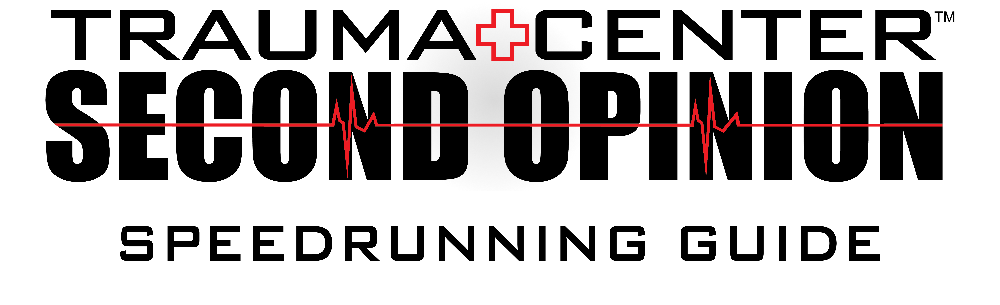

 
{:id: .headerImage}
## Introduction
This guide is aimed to provide insight and guidance on the techniques and strategies employed while speedrunning TCSO. Ceci est adressé à ceux qui ont déjà joué au jeu mais qui voudraient plus de détails sur comment s'améliorer.
Chaque chapitre possède sa propre page, comme pour chaque souche de TAC pour aider à garder ce guide digeste.

## Table des matières
### Chapitres du jeu
* [Chapitre 1](../../chp/fr/chp1.md)
* [Chapitre 2](../../chp/fr/chp2.md)
* [Chapitre 3](../../chp/fr/chp3.md)
* [Chapitre 4](../../chp/fr/chp4.md)
* [Chapitre 5](../../chp/fr/chp5.md)
* [Chapitre Z](../../chp/fr/chpZ.md)
* [Chapitre 6](../../chp/fr/chp6.md)

### Guides TAC
* [Kyriaki](../../guilt/fr/kyriaki.md)
* [Deftera](../../guilt/fr/deftera.md)
* [Triti](../../guilt/fr/triti.md)
* [Tetarti](../../guilt/fr/tetarti.md)
* [Pempti](../../guilt/fr/pempti.md)
* [Paraskevi](../../guilt/fr/paraskevi.md)
* [Savato](../../guilt/fr/savato.md)

## Conseil général

Du fait que TCSO repose sur des compétances motrices concernant le contrôle de la manette Wii et de la Nunchuck, la plupart du temps pour devenir meilleur il va falloir beaucoup d'entraînement pour se sentir plus confortable sur les contrôles. Second Opinion a la sensibilité du curseur la plus basse en sachant qu'il a été fait avec un ratio de résolution 4:3. Ce qui veut dire que si vous venez d'autres jeu de la série Trauma Center le curseur peut vous sembler un peu lent. Avec de l'entraînement ça ne devrait pas être un problème.
Tout comme apprendre un instrument, commencer lentement et s'assurer que vous avez les bons mouvement est aussi important que votre connaissance du jeu. Si vous commencez lentement, vous allez pouvoir augmenter votre vitesse avec l'entraînement.

### Bar sensorielle
Basé sur le fait que tout est contrôlé par le curseur, il est crucial de s'assurer que la bar sensorielle soit bien installée pour vous assurer des résultas constants. Vous allez avoir besoin de changer ces paramètres dans le menu des paramètres de la Wii hors du jeu. Tout d'abord, assurez vous que votre bar sensorielle soit bien positionnée, soit au dessus ou en dessous de l'écran. Cela va décaler le curseur pour un ressenti plus naturel. Ce n'est pas strictement nécessaire mais ça aide à éviter de pointer avec la manette avec un angle inconfortable.
Pour la sensibilité de la barre sensorielle, vous devez viser le fait de l'avoir le plus bas possible. Si vous avez les conditions parfaites, avoir la sensibilité mise à 1 va être le mieux, mais en fonction de votre configuration pour jouer, vous allez peut-être utiliser 2 ou 3. Le plus bas est le meilleur si possible. Je recommande définitivement de regarder ce paramètre, vous trouverez sûrement que vous pourrez plus facilement compter sur vos sutures et étoiles (main curratrice).

### Changement d'outils
Luckily in SO we use the nunchuck to tool switch, so we don't have to waste too much time with tapping the tools we want unlike in the DS games. But being able to select the tools you need at the exact time will help with your pacing. You'll be less likely to fumble, or to miss and waste precious vitals. To improve your tool switching, I highly recommend Kyriaki, as well as 2-1 (Thrombi). Anticipating when you need to tool switch, and then executing means you are spending less time waiting around, even if it is for only a second it will add up over the course of a full run. That being said, don't take this too far. You don't want to be tool switching too early. This is especially true with sutures as they will be discarded if you tool switch away before letting go of A or B.
If your nunchuck suffers from "snapback", where you hold the stick and let go and it selects the opposite tool, the best way around this is to simply lock the stick into the direction you are using at the time. The exception to this is if you're always going to be using that tool (eg: Pempti requires the laser 90% of the time, so there is no use holding the stick down all the time). This means the stick cannot snap back into the opposite direction and select the wrong tool.

### Main curratrice
En prenant en compte que la main curratrice (HT pour Healing Touch pour nos amis anglais) ralenti le jeu, et n'importe quel chronomètre basé sur le moteur du jeu. Cela veut dire qu'il est utile pour passer des cycles ou laisser plus de temps pour souffler en cas de difficulté. Cependant vous devez éviter de l'utiliser dans la plupart des opérations, car s'il se passe trop de chose quand la main curratrice est active le jeu va commencer à lag. Cependant, si vous en avez besoin, n'ayez pas peur d'utiliser la main curratrice pour vous laisser un temps pour respirer si la situation est mauvaise.
Presque toutes les opérations du Chapitre Z utilisent la main curratrice de Naomi, et ça s'applique également au niveau 6-4, donc vous pouvez ignorer le conseil de ne pas l'utiliser, car les avantages surpassent les inconvénients dans ces opérations.
Si vous incarnez Naomi lors d'une opération et que vous avez besoin de remonter les signes vitaux du patient, au lieu d'utiliser la seringue utilisez plutôt sa main curratrice.

### Menuing, Text Skip, et Episode Select Skip (ESS)
En dehors des opérations, c'est très facile de perdre du temps en sélectionnant les mauvaises options. Et du fait que c'est souvent une erreur de débutant, vous assurez de sélectionner la bonne option (et au bon moment aussi) va vous aider à gagner du temps. Dès que vous commencez une opération, la seule chose à faire est de mash (spammer) le bouton A afin de sélectionner OUI. Mais à d'autres moment c'est important d'être prêt à utiliser votre curseur pour choisir chaque option. Je ne recommande pas d'utiliser le D-Pad car vous pouvez pointer votre curseur bien plus rapidement sans ajuster votre prise de main. De plus vous devez mash le bouton A quand la carte apparaît, tout comme quand vous terminez une opération pour arriver au message "Le patient est sauvé" et votre score.
Sans text skip, Second Opinion serait vraiment très long (on te voit Trauma Team). Il suffit de presser le bouton ( - ) sur votre manette pour activer le text skip et laisser le dialogue défiler. Mais savoir quand le faire peut être plus difficile, il y a 3 temps dont il faut vous rappeler:
* Lorsque vous chargez une opération la première fois, après avoir mash à travers la carte et l'affichage du titre, quand la boîte de dialogue (ou le personnage) apparaît, activez le skip.
* Lorsque vous chargez dans le debrief avant l'opération ou après l'opération, c'est la même chose. Dès que la boîte de dialogue apparaît, activez le skip.
* Lorsque l'opération charge, avant que le message "Début de l'opération" finisse, assurez vous d'avoir enclenché le text skip.

Un Episode Select Skip, ou plus connu sous le nom de ESS est un skip qui se passe après la majorité des operations. Chaque épisode a un dialogue de post-opération après avoir obtenu le score. A part les opération marquées d'un astérisque ( * ) , il est plus rapide d'appuyer sur plus ( + ) pour faire pause, puis sélectionner sélection d'épisode et OUI. Cela enlève tout le dialogue et l'histoire qu'il y a après l'opération. Je vous recommande de regarder les splits existants des runners du jeu, ou d'utiliser les fichiers de splits disponibles sur [la page de Speerun.com](https://www.speedrun.com/tcso/resources). **L'ESS doit asbolument être réalisé sur les épisodes qui ne sont pas des opérations (ex: 1-4).**
Lorsque vous faites un ESS sur un épisode qui n'est pas une opération, vous devez réussir à le faire avant que la boîte qui affiche le titre et l'épisode apparaisse. Vous devez mash pendant la carte, puis mash plus ( + ) dès que possible pour arriver au menu avant l'apparition de la boite de titre. Notez qu'il y a des épisodes qui ne sont pas des opérations où vous pouvez faire l'ESS instantanément car il n'y a pas de carte, comme l'épisode 3-1, 4-5, et 6-1.
 
### Sauvegarde automatique
A chaque fois que vous allez commencer une run, vous devez **désactiver** la sauvegarde automatique. Avant d'aller dans Nouvelle partie sur le menu principale, allez dans Configuration, et faites désactivez le. Cette manipulation assure que le jeu n'enregistre pas automatiquement votre progression entre chaque épisode car cela ajoute 3 secondes suplémentaires pour chaque épisode, qui au total font environ 2 minutes sur la run. Parce qu'on effectue la run entièrement en une fois, on ne veut pas ce paramètre d'activé.
_Ce paramètre se réinitialise si vous avez chargé une partie et êtes revenu au menu, donc soyez sûr de le vérifier avant de commencer votre run._

### Gel and Bandages
Given how questionable the gel is in Second Opinion, you'll need to apply it differently depending on the situation. First of all, for most incisions you'll want to gel before you open the patient as the tolerances are very tight and you'll likely get a miss. Any time you need to get small cuts, just tapping them is good enough however if they are clustered together (eg: 1-1 in the arm) it is better to slather the gel over each cut. For tumour membranes, tapping them is preferred as it is quicker.
For the bandage, as long as it covers approximately 40% of incision, you should be okay. That being said if you miss, it will cause 5 vitals to be dropped and you can kill the patient with this, so be sure to be more careful if the patient is very low. You **don't** want to gel before the bandage (except in 1-1) as it is much slower.

### Posture, Stretching, and Breaks
Since you're pointing a Wiimote for over an hour, ensuring you are comfortable and that your hand is stable, and relaxed is pretty important. Each runner has their own preferred posture and way to sit during runs, however they all share one key concept. You want to support your wrist and forearm as best you can. This ensures that your hand is naturally stable, and that the cursor isn't shaking when you are just aiming to hold it still at a given point on the screen. For me personally, I use a blanket between my lower thighs/knees as this adds some padding/cushioning, as well as a foot-rest. I have seen other runners sit with their arms in a sort of inward V facing the screen with their forearms resting over their thighs, and other runners place it at the very top of their thigh near their hip. Find whatever is comfortable for you!
Following on from this, it's **very** important to stretch, to give your hand time to relax. Mid-run there are opportunities to stretch your hands out and ensure they do not cramp up. Notably in the dialogue before: 3-4, 4-4, and 6-4. I highly recommend this video from Dr Levi: https://youtu.be/EiRC80FJbHU - It covers a lot of important stretches, and how to loosen up your hands too.
When you're on the grind to get a new time it's easy to forget to take breaks. If you don't you are near guaranteed to give yourself Repeatitive Strain Injury (RSI). Just give yourself five minutes to allow your muscles to relax, and your joints to ease up, plus you're less likely to get tilted too! This is especially important during practice. Don't allow yourself to play the same operation over and over and over for more than 20 minutes without stopping for two minutes at least.

### Signes vitaux
En se basant que le jeu tourne autour du fait de soigner les patients et de les garder en vie, cela peut être surprenant qu'en pratiquant le speedrun on évite de remonter les signes vitaux. Simple chose, cela prend un temps précieux qui pourraît être utiliser pour traiter la condition du patient. Cela varie selon les opération évidemment et si je listais des nombres spécifiques ça serait stupidement long et presque inutile de le faire car vous ne vous en souviendriez pas. Mais apprendre quand il ne faut pas remonter les signes vitaux du patient va vous économiser du temps. Avec le temps, vous saurez quand il faut le faire.
Au contraire cependant, si vous ne faites rien d'autre qu'attendre, par exemple si votre outil est inutilisable, ou si vous attendez une animation ou un cycle, remonter les signes vitaux du patient peut être une bonne utilisation de ce temps. Ne laissez pas ça aller trop loin en remontant les points de vie du patient alors que vous pourriez finir l'opération. Les exemples les plus courants de ceci :
* En attendant que Deftera fusionne (tant qu'il n'y a pas de tumeur ou d'hémorragie)
* En attendant que Paraskevi apparaisse
* En attendant le rechargement de votre laser dans le combat contre Savato (S'il n'y a pas de lacérations et que vous avez au dessus de 20 points de signes vitaux)

### Routing & Region Differences
This is a very very minor thing to worry about, but after some investigation and testing the animation timings, doing Chapitre Z **after** the first five Chapitres of the game means you save 1.5~ seconds overall. As mentioned this is a very small thing, and if you are more comfortable with doing Chapitre Z as you go, continue to do so until you are reaching top tier times.
If you wish to go for the new routing option, play the game as normal and after Chapitre 1, ignore Z-1 and go back down to 2-1. From then on, you won't ever be transitioned over to the other side of the Episode Select area. When you finish Savato 1 in Chapitre 5, you will need to be ready to press the up arrow on the D-PAD while the cursor is on the Chapitre number on the left. You will need to press this 4 times, then put your cursor at the bottom right and scroll slightly to bring up Z-1.
Now this isn't something you should really worry about until you get to top-tier times (aka, faster than SZSK / <1:25:00) but running the game in Japanese means there is less text to skip, and it saves you around 25-30 seconds across the entire run. Let me stress: **this is not critical. Just because you have a PAL/NTSC-U copy does not mean you shouldn't try.**

For reference, it is possible to close into a time of 1:21:00 comfortably without worrying about localisation. It is just common that after improving your time and investing yourself into the game for long enough, that having a JP or NTSC-J copy of the game is likely, and not a requirement.
